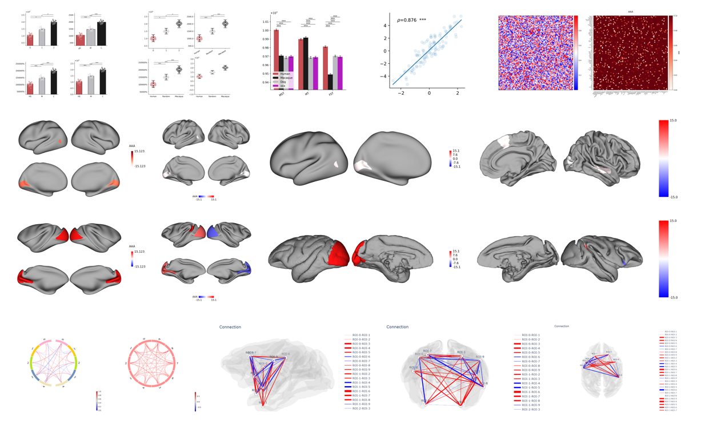

<div align="center">

# plotfig

[English](README.md) | [中文文档](README_zh.md)

[](https://badge.fury.io/py/plotfig)
[](https://www.python.org/downloads/)
[](LICENSE)

A Python visualization library designed for cognitive neuroscience research, providing efficient, easy-to-use, and beautiful plotting tools.



</div>

## Features

- 📊 **Multiple Chart Types**: Bar charts, matrix plots, correlation plots, circos plots, brain surface plots, brain connectivity plots
- 🎨 **Professional Research Style**: Built-in color schemes that meet academic publication standards
- 📈 **Automatic Significance Testing**: Built-in statistical methods with automatic significance annotations
- 🔬 **Designed for Neuroscience**: Supports common primate brain atlases and brain network visualization
- 🚀 **Easy to Use**: Simple API for quick getting started

## Quick Start

```python
import matplotlib.pyplot as plt

from plotfig import plot_one_group_bar_figure

# Plot single group bar chart
data = [[1.2, 2.3, 3.1], [4.5, 5.6, 6.2]]
plot_one_group_bar_figure(data)
plt.show()
```

## Installation

`plotfig` requires Python 3.11 or higher.

**Install with uv:**

```bash
uv add plotfig
```

**Install with pip:**

```bash
pip install plotfig
```

## Documentation

For detailed documentation and usage examples, please visit the [plotfig documentation](https://ricardoryn.github.io/plotfig/en/).

## Contributing

We welcome Issues and PRs! Whether it's bug reports, feature suggestions, or documentation improvements, please feel free to open an [Issue](https://github.com/RicardoRyn/plotfig/issues).

For contribution guidelines, please see the [contribution guide](https://ricardoryn.github.io/plotfig/).
