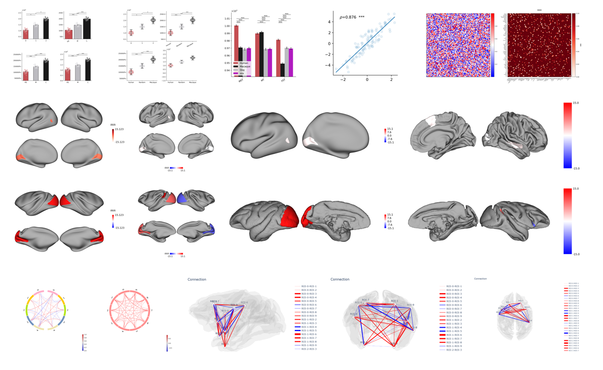

# Introduction

`plotfig` is a Python library designed specifically for scientific data visualization, dedicated to providing efficient, easy-to-use, and beautiful plotting tools for cognitive neuroscience researchers.
This project is developed based on mainstream visualization libraries in the industry—`matplotlib`, `surfplot`, and `plotly`, integrating their powerful features to meet the complex plotting needs in neuroscience and brain connectomics across various scenarios.

## Project Structure

The project adopts a modular design, containing the following main functional modules:

- `bar.py`: Bar chart plotting, suitable for comparative display of grouped data.
- `matrix.py`: General matrix visualization, supporting multiple color schemes and annotation methods.
- `correlation.py`: Correlation matrix visualization, facilitating analysis of correlation distributions between variables.
- `circos.py`: Circos plot visualization, suitable for planar display of connections between brain regions.
- `brain_surface.py`: Brain surface visualization, enabling plotting of 3D brain surface atlas structures.
- `brain_connection.py`: Glass brain connectivity visualization, supporting complex brain network structure display.

## Features

- The `plotfig` API has a simple design with flexible parameters, making it suitable for researchers and data analysts to quickly integrate into their data analysis workflows.
- Its modular architecture facilitates future feature expansion and custom development.
- Combined with `matplotlib`, it supports vector graphics, high-resolution bitmap, and interactive HTML output, suitable for paper publication and academic presentation.

---

Fun fact: All elements of a figure[^1].

[^1]: [Quick start guide of matplotlib.](https://matplotlib.org/stable/tutorials/introductory/usage.html#parts-of-a-figure)