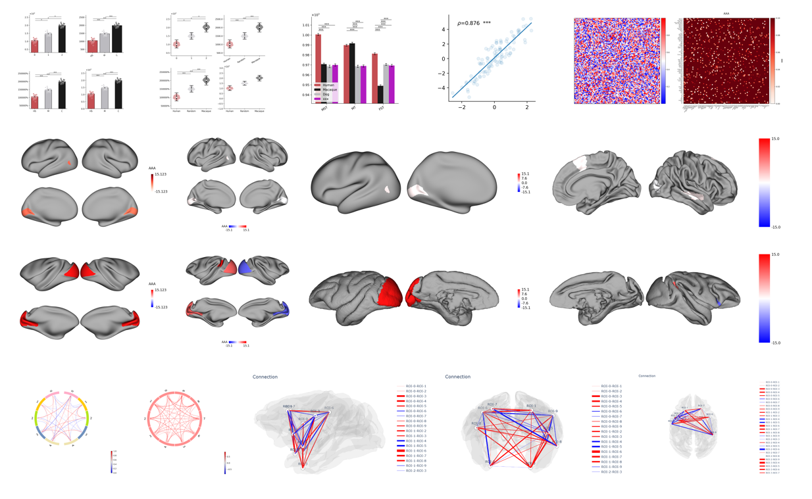

# Introduction

`plotfig` is a Python library designed specifically for scientific data visualization, dedicated to providing efficient, easy-to-use, and beautiful plotting tools for cognitive neuroscience researchers.
This project is developed based on mainstream visualization libraries in the industry—`matplotlib`, `surfplot`, and `plotly`, integrating their powerful features to meet the complex plotting needs in neuroscience and brain connectomics across various scenarios.

## Project Structure

The project adopts a modular design, containing the following main functional modules:

- `bar.py`: Bar chart plotting, suitable for comparative display of grouped data.
- `matrix.py`: General matrix visualization, supporting multiple color schemes and annotation methods.
- `correlation.py`: Correlation matrix visualization, facilitating analysis of correlation distributions between variables.
- `circos.py`: Circos plot visualization, suitable for planar display of connections between brain regions.
- `brain_surface.py`: Brain surface visualization, enabling plotting of 3D brain surface atlas structures.
- `brain_connection.py`: Glass brain connectivity visualization, supporting complex brain network structure display.

## Features

- The `plotfig` API has a simple design with flexible parameters, making it suitable for researchers and data analysts to quickly integrate into their data analysis workflows.
- Its modular architecture facilitates future feature expansion and custom development.
- Combined with `matplotlib`, it supports vector graphics, high-resolution bitmap, and interactive HTML output, suitable for paper publication and academic presentation.

---

## Core Three Elements of Matplotlib: Figure, Axes, and Subplot

Fun fact: All elements of a figure[^1].

When using Matplotlib to create plots, Figure, Axes, and Subplot are the three most fundamental and essential concepts.
Understanding the relationship among them is key to mastering Matplotlib's underlying logic.

### Figure (Canvas / Graphic Window)

A Figure is the top‑level container for the entire plotting.
You can think of it as a blank canvas or the graphic window that appears on your screen.
The Figure holds all plotting elements.

You can set global properties on it, such as the overall size (figsize), background color, resolution (dpi), etc.

### Axes (Coordinate System / Plotting Area)

Axes are the actual “plotting area” in Matplotlib, and where most of the data manipulation and drawing happens.
An Axes is a rectangular region equipped with a data coordinate system.
It includes not only the graphical elements you draw (lines, scatter points, bars, etc.) but also all auxiliary components such as the X‑axis, Y‑axis, tick labels, axis labels, titles, and more.

A single Figure can contain multiple Axes objects.
These Axes can be arranged in a regular grid, or they can be placed freely anywhere on the canvas, independent of any grid.

### Subplot (Sub‑plot / Grid Partition)

A Subplot is a special term for an Axes that is placed in a regular grid.
When you want to display multiple charts neatly on one canvas (for example, a vertical comparison or a 2×2 layout), you divide the canvas into a regular grid.
Each grid cell then contains an Axes, and that Axes is called a Subplot.

In essence, a Subplot is exactly the same as an Axes.
They share the same properties and methods (both can be used for plotting and for setting axis properties).
The only difference is that Subplots are created in batch using the `subplots()` function, which arranges them in a predefined grid.

!!! info
    Subplot: specifically refers to an Axes that is generated via `subplots()` or `add_subplot()` within a regular grid.

    Axes: a broader concept. It includes not only grid‑based subplots, but also axes placed arbitrarily on the canvas using `add_axes([left, bottom, width, height])`, as well as embedded inset axes (Inset Axes) nested inside a main plot.

[^1]: [Quick start guide of matplotlib.](https://matplotlib.org/stable/tutorials/introductory/usage.html#parts-of-a-figure)
