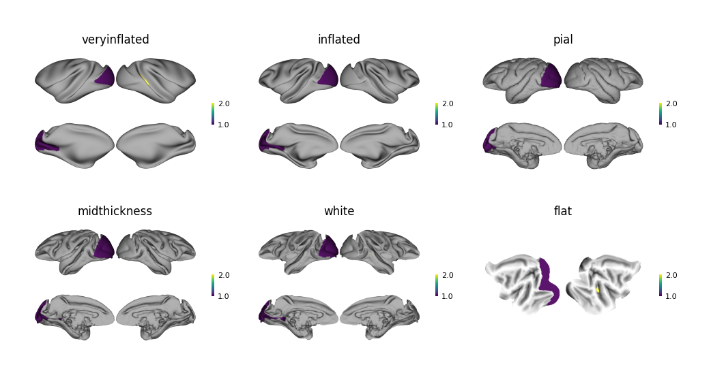

# Brain Surface Plot

Brain surface plot is a chart used to visualize numerical data on the cerebral cortex surface.
It can map values of different brain regions to corresponding areas of the cerebral cortex and display the distribution of these values in a color-coded manner.
This type of chart is commonly used to display various brain region metrics in neuroscience research, such as BOLD signal intensity, myelination degree, volume or thickness, or other quantifiable brain features.

The `plot_brain_surface_figure` function is developed based on the `surfplot` library, providing a unified and simplified interface for plotting brain surface maps for human, macaque, and chimpanzee brains.
Currently supports multiple brain atlases including:

1. Human Glasser (HCP-MMP) atlas[^1]. [Atlas CSV file](../../assets/atlas_csv/human_glasser.csv).
1. Human BNA atlas[^2]. [Atlas CSV file](../../assets/atlas_csv/human_bna.csv).
1. Chimpanzee BNA atlas[^3]. [Atlas CSV file](../../assets/atlas_csv/chimpanzee_bna.csv).
1. Macaque CHARM 4-level[^4]. [Atlas CSV file](../../assets/atlas_csv/macaque_charm4.csv).
1. Macaque CHARM 5-level[^4]. [Atlas CSV file](../../assets/atlas_csv/macaque_charm5.csv).
1. Macaque CHARM 6-level[^4]. [Atlas CSV file](../../assets/atlas_csv/macaque_charm6.csv).
1. Macaque BNA atlas[^5]. [Atlas CSV file](../../assets/atlas_csv/macaque_bna.csv).
1. Macaque D99 atlas[^6]. [Atlas CSV file](../../assets/atlas_csv/macaque_d99.csv).

[^1]:
    Glasser, M. F., Coalson, T. S., Robinson, E. C., Hacker, C. D., Harwell, J., Yacoub, E., Ugurbil, K., Andersson, J., Beckmann, C. F., Jenkinson, M., Smith, S. M., & Van Essen, D. C. (2016). A multi-modal parcellation of human cerebral cortex. Nature, 536(7615), Article 7615. https://doi.org/10.1038/nature18933
[^2]:
    Fan, L., Li, H., Zhuo, J., Zhang, Y., Wang, J., Chen, L., Yang, Z., Chu, C., Xie, S., Laird, A. R., Fox, P. T., Eickhoff, S. B., Yu, C., & Jiang, T. (2016). The Human Brainnetome Atlas: A New Brain Atlas Based on Connectional Architecture. Cerebral Cortex (New York, N.Y.: 1991), 26(8), 3508–3526. https://doi.org/10.1093/cercor/bhw157
[^3]:
    Wang, Y., Cheng, L., Li, D., Lu, Y., Wang, C., Wang, Y., Gao, C., Wang, H., Erichsen, C. T., Vanduffel, W., Hopkins, W. D., Sherwood, C. C., Jiang, T., Chu, C., & Fan, L. (2025). The Chimpanzee Brainnetome Atlas reveals distinct connectivity and gene expression profiles relative to humans. The Innovation, 0(0). https://doi.org/10.1016/j.xinn.2024.100755
[^4]:
    Jung, B., Taylor, P. A., Seidlitz, J., Sponheim, C., Perkins, P., Ungerleider, L. G., Glen, D., & Messinger, A. (2021). A comprehensive macaque fMRI pipeline and hierarchical atlas. NeuroImage, 235, 117997. https://doi.org/10.1016/j.neuroimage.2021.117997
[^5]:
    Lu, Y., Cui, Y., Cao, L., Dong, Z., Cheng, L., Wu, W., Wang, C., Liu, X., Liu, Y., Zhang, B., Li, D., Zhao, B., Wang, H., Li, K., Ma, L., Shi, W., Li, W., Ma, Y., Du, Z., … Jiang, T. (2024). Macaque Brainnetome Atlas: A multifaceted brain map with parcellation, connection, and histology. Science Bulletin, 69(14), 2241–2259. https://doi.org/10.1016/j.scib.2024.03.031
[^6]:
    Reveley, C., Gruslys, A., Ye, F. Q., Glen, D., Samaha, J., E. Russ, B., Saad, Z., K. Seth, A., Leopold, D. A., & Saleem, K. S. (2017). Three-Dimensional Digital Template Atlas of the Macaque Brain. Cerebral Cortex, 27(9), 4463–4477. https://doi.org/10.1093/cercor/bhw248

## Quick Plot

!!! info
    Please ensure brain region names are correct before plotting.

```python
from plotfig import plot_brain_surface_figure

data = {"lh_V1": 1, "rh_MT": 1.5}

ax = plot_brain_surface_figure(data, species="human", atlas="glasser")
```


```python
from plotfig import plot_brain_surface_figure
import matplotlib.pyplot as plt

macaque_data = {"lh_V1": 1}
chimpanzee_data = {"lh_MVOcC.rv": 1}

fig, (ax1, ax2) = plt.subplots(1, 2, figsize=(10, 5))

ax1 = plot_brain_surface_figure(
    chimpanzee_data, species="chimpanzee", atlas="bna", ax=ax1, title_name="Chimpanzee"
)
ax2 = plot_brain_surface_figure(
    macaque_data, species="macaque", atlas="charm5", ax=ax2, title_name="Macaque"
)
```


## Different Surface Files

For humans, the following surface files are provided:

1. `veryinflated`
2. `inflated`
3. `midthiickness`
4. `sphere`
5. `flat`

```python
from plotfig import plot_brain_surface_figure
import matplotlib.pyplot as plt

fig, axes = plt.subplots(2, 3, figsize=(12, 6))
fig.delaxes(axes[1, 2])

plot_data = {"lh_V1": 1, "rh_FST": 2}

ax1 = plot_brain_surface_figure(plot_data, surf="veryinflated", ax=axes[0,0], title_name="veryinflated")
ax2 = plot_brain_surface_figure(plot_data, surf="inflated", ax=axes[0,1], title_name="inflated")
ax3 = plot_brain_surface_figure(plot_data, surf="midthickness", ax=axes[0, 2], title_name="midthickness")
ax4 = plot_brain_surface_figure(plot_data, surf="sphere", ax=axes[1,0], title_name="sphere")
ax5 = plot_brain_surface_figure(plot_data, surf="flat", ax=axes[1,1], title_name="flat")
```


For chimpanzees, the following surface files are provided:

1. `veryinflated`
2. `midthiickness`

```python
from plotfig import plot_brain_surface_figure
import matplotlib.pyplot as plt

fig, axes = plt.subplots(1, 2)

plot_data = {"lh_MVOcC.rd": 1, "rh_STG.r": 2}

ax1 = plot_brain_surface_figure(plot_data, species="chimpanzee", atlas="bna", surf="veryinflated", ax=axes[0], title_name="veryinflated")
ax3 = plot_brain_surface_figure(plot_data, species="chimpanzee", atlas="bna", surf="midthickness", ax=axes[1], title_name="midthickness")
```


For macaques, the following surface files are provided:

1. `veryinflated`
2. `inflated`
4. `pial`
3. `midthiickness`
5. `white`
6. `flat`

```python
from plotfig import plot_brain_surface_figure
import matplotlib.pyplot as plt

fig, axes = plt.subplots(2, 3, figsize=(12, 6))

plot_data = {"lh_V1": 1, "rh_FST": 2}

ax1 = plot_brain_surface_figure(plot_data, species="macaque", atlas="charm5", surf="veryinflated", ax=axes[0,0], title_name="veryinflated")
ax2 = plot_brain_surface_figure(plot_data, species="macaque", atlas="charm5", surf="inflated", ax=axes[0,1], title_name="inflated")
ax3 = plot_brain_surface_figure(plot_data, species="macaque", atlas="charm5", surf="pial", ax=axes[0, 2], title_name="pial")
ax4 = plot_brain_surface_figure(plot_data, species="macaque", atlas="charm5", surf="midthickness", ax=axes[1,0], title_name="midthickness")
ax5 = plot_brain_surface_figure(plot_data, species="macaque", atlas="charm5", surf="white", ax=axes[1,1], title_name="white")
ax6 = plot_brain_surface_figure(plot_data, species="macaque", atlas="charm5", surf="flat", ax=axes[1,2], title_name="flat")
```



## More Settings

For all parameters, see the API documentation for [`plot_brain_surface_figure`](../api/#plotfig.brain_surface.plot_brain_surface_figure).

```python
from plotfig import plot_brain_surface_figure

data = {"lh_V1": 1, "rh_MT": 1.5, "rh_V1": -1}

ax = plot_brain_surface_figure(
    data,
    species="human",
    atlas="glasser",
    surf="inflated",
    cmap="bwr",
    vmin=-1,
    vmax=1,
    colorbar=True,
    colorbar_label_name="AAA"
)
```


