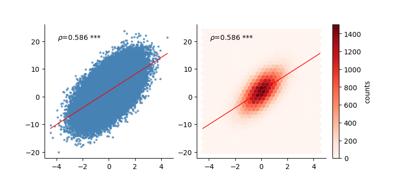

# Correlation Plot

Point-line correlation plot is a type of visualization chart used to display the correlation relationship between two variables. It typically plots a pair of variable values for each sample as points in the chart, and reflects their degree of correlation through fitted lines, correlation coefficients, and significance annotations.
It is a common method for exploring linear or nonlinear relationships between variables, especially common in scientific research and data analysis.

`plot_correlation_figure` provides concise and easy-to-use point-line correlation plot functionality, capable of automatically plotting variable scatter points and fitted lines, and can calculate and display both Spearman or Pearson correlation coefficients (Spearman correlation is calculated by default).
At the same time, `plot_correlation_figure` will automatically annotate `*`, `**`, or `***` based on significance levels, helping users quickly determine whether the correlation is significant, making it suitable for use in research charts, presentation slides, or paper illustrations.

## Quick Plot

Suppose we have two sets of data with the same sample size (each set contains 100 samples), and we want to visually display through plotting whether there is a correlation between them.
This is usually achieved through point-line correlation plots, plotting each pair of sample values as scatter points, and combining with fitted lines and correlation coefficients to determine the degree and significance of correlation between variables.

```python
import numpy as np
import matplotlib.pyplot as plt
from plotfig import *

np.random.seed(42)
data1 = np.arange(100)
data2 = data1 + np.random.normal(1,50, 100)
# data2 adds noise on top of data1.
# Serious people know that data1 and data2 are correlated, so does plotfig know?

ax = plot_correlation_figure(data1,data2)
```


## Hexbin Plot

Using `hexbin=True`. We can display the density distribution of a large number of scatter points without drawing all scatter points.

```python
import numpy as np
import matplotlib.pyplot as plt
from plotfig import *

np.random.seed(42)
n = 100_000
data1 = np.random.standard_normal(n)
data2 = 2.0 + 3.0 * data1 + 4.0 * np.random.standard_normal(n)

fig, (ax1, ax2) = plt.subplots(1, 2, figsize=(7, 3), layout="constrained")
ax1 = plot_correlation_figure(
    data1,
    data2,
    ax=ax1
)

hb = plot_correlation_figure(
    data1,
    data2,
    ax=ax2,
    hexbin=True,
    hexbin_cmap="Reds",
    hexbin_gridsize=30
)
cb = fig.colorbar(hb, ax=ax2, label='counts')
```



## Parameter Settings

For all parameters, see the API documentation for [`plot_correlation_figure`](../api/#plotfig.correlation).

```python
import numpy as np
import matplotlib.pyplot as plt
from plotfig import *

np.random.seed(42)
data1 = np.arange(100)
data2 = data1 + np.random.normal(1,50, 100)
# data2 adds noise on top of data1.
# Serious people know that data1 and data2 are correlated, so does plotfig know?

fig, ax = plt.subplots(figsize=(3, 3))
ax = plot_correlation_figure(
    data1,
    data2,
    stats_method="spearman",  # Only "spearman, pearson", default is spearman
    ci=True,  # Display 95% confidence interval
    dots_color="green",
    line_color="pink",
    title_name="Correlation between data1 and data2",
    title_fontsize=10,
    title_pad=20,  # Control the distance between title and plot, default is 10
    x_label_name="Data1",
    y_label_name="Data2",
    xlim=(0,100),
    ylim=(-100,150),
)
```


