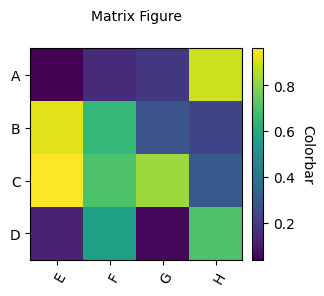

# Matrix Plot

Matrix plot is a visualization method used to display pairwise relationships between multiple variables. A common form is a symmetric two-dimensional grid, where each cell represents the statistical relationship between a pair of variables.
It is commonly used to explore the correlation structure between multiple variables in a dataset and is a common tool in data analysis and scientific plotting.

`plot_matrix_figure` supports automatic generation of matrix plots.

## Quick Plot

We can generate a 10 × 19 matrix plot to display pairwise relationships between 10 elements and another 19 elements.

```python
import numpy as np
from plotfig import *

data = np.random.rand(10, 19)

ax = plot_matrix_figure(data)
```


## Parameter Settings

For all parameters, see the API documentation for [`plot_matrix_figure`](../api/#plotfig.matrix.plot_matrix_figure).

```python
import numpy as np
import matplotlib.pyplot as plt
from plotfig import *

data = np.random.rand(4,4)

fig, ax = plt.subplots(figsize=(3,3))
ax = plot_matrix_figure(
    data,
    row_labels_name=["A", "B", "C", "D"],
    col_labels_name=["E", "F", "G", "H"],
    cmap="viridis",
    title_name="Matrix Figure",
    title_fontsize=10,
    colorbar=True,
    colorbar_label_name="Colorbar",
)
```


