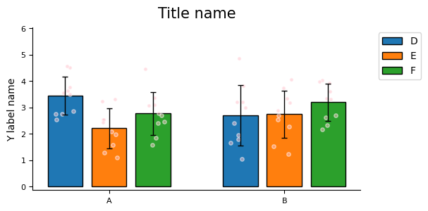
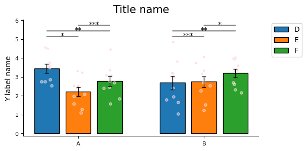

# Multi-Group Bar Chart

## Quick Plot

We use multi-group bar chart to display the overall distribution of data.
This chart contains two groups of data (i.e., two main categories), with each group containing three sub-bars, representing different sub-conditions or variables.
Within each bar, 10 sample points are drawn, reflecting individual-level variability or observed values.

This graphical structure helps with simultaneous comparison of:

- Average differences between different conditions within each group;
- Overall trends between different groups;
- Dispersion or distribution characteristics of samples under each condition.

To enhance information expression, error bars (such as standard deviation or standard error) are superimposed on the bar chart, and scatter plots are used to display the sample distribution within each bar.

```python
import numpy as np
from plotfig import *

np.random.seed(42)
group1_bar1 = np.random.normal(3, 1, 10)
group1_bar2 = np.random.normal(3, 1, 10)
group1_bar3 = np.random.normal(3, 1, 10)
group2_bar1 = np.random.normal(3, 1, 10)
group2_bar2 = np.random.normal(3, 1, 10)
group2_bar3 = np.random.normal(3, 1, 10)

ax = plot_multi_group_bar_figure([[group1_bar1, group1_bar2, group1_bar3], [group2_bar1, group2_bar2, group2_bar3]])
```


## Plot Beautification

Similar to single-group bar charts, multi-group bar charts also provide a large number of adjustable parameters for flexible control of the chart appearance.
This section only shows a portion of these parameters.

For the complete parameter list, please refer to the API documentation for [`plot_multi_group_bar_figure`](../api/#plotfig.bar.plot_multi_group_bar_figure).

```python
import numpy as np
import matplotlib.pyplot as plt
from plotfig import *

np.random.seed(42)
group1_bar1 = np.random.normal(3, 1, 10)
group1_bar2 = np.random.normal(3, 1, 10)
group1_bar3 = np.random.normal(3, 1, 10)
group2_bar1 = np.random.normal(3, 1, 10)
group2_bar2 = np.random.normal(3, 1, 10)
group2_bar3 = np.random.normal(3, 1, 10)

fig, ax = plt.subplots(figsize=(6, 3))
ax = plot_multi_group_bar_figure(
    [[group1_bar1, group1_bar2, group1_bar3], [group2_bar1, group2_bar2, group2_bar3]],
    ax=ax,
    group_labels=["A", "B"],
    bar_labels=["D", "E", "F"],
    bar_width=0.2,
    bar_gap=0.05,
    bar_color=["tab:blue", "tab:orange", "tab:green"],
    errorbar_type="sd",
    dots_color="pink",
    dots_size=15,
    title_name="Title name",
    title_fontsize=15,
    y_label_name="Y label name",
)
```



## Statistics

Multi-group bar charts currently only support passing p-values through external statistical tests and annotating asterisks at corresponding positions within groups.

For detailed explanation of "external statistical tests", please refer to: [Single Group Bar Chart / Statistics](single_group.md#_7).

```python
import numpy as np
import matplotlib.pyplot as plt
from plotfig import *

np.random.seed(42)
group1_bar1 = np.random.normal(3, 1, 10)
group1_bar2 = np.random.normal(3, 1, 10)
group1_bar3 = np.random.normal(3, 1, 10)
group2_bar1 = np.random.normal(3, 1, 10)
group2_bar2 = np.random.normal(3, 1, 10)
group2_bar3 = np.random.normal(3, 1, 10)

fig, ax = plt.subplots(figsize=(6, 3))
ax = plot_multi_group_bar_figure(
    [[group1_bar1, group1_bar2, group1_bar3], [group2_bar1, group2_bar2, group2_bar3]],
    ax=ax,
    group_labels=["A", "B"],
    bar_labels=["D", "E", "F"],
    bar_width=0.2,
    bar_gap=0.05,
    bar_color=["tab:blue", "tab:orange", "tab:green"],
    errorbar_type="se",
    dots_color="pink",
    dots_size=15,
    title_name="Title name",
    title_fontsize=15,
    y_label_name="Y label name",
    statistic=True,
    test_method="external",
    p_list=[[0.05, 0.01, 0.001], [0.001, 0.01, 0.05]]
)
```


