# Single Group Bar Chart

## Quick Plot

Bar chart is a common graphical tool used to display numerical comparisons between different categories.
It represents the values of each category through a set of vertical or horizontal rectangular bars, with the height (or length) of the bars corresponding to the size of the data.
Bar charts are intuitive and clear, suitable for comparing means between groups, especially for visualizing discrete categorical data.
In scientific research and data analysis, bar charts are often used to present differences between experimental groups and control groups.
`plotfig` is developed based on the powerful `matplotlib`, simplifying the plotting process and making comparisons between multiple groups of data more intuitive.

For example, we have 3 groups of data (with 9, 10, and 11 samples respectively) and we want to display the differences between them through a bar chart.

```python
import numpy as np
from plotfig import *

data1 = np.random.normal(1, 1, 9)
data2 = np.random.normal(2, 1, 10)
data3 = np.random.normal(3, 1, 11)

ax = plot_one_group_bar_figure([data1, data2, data3])
```

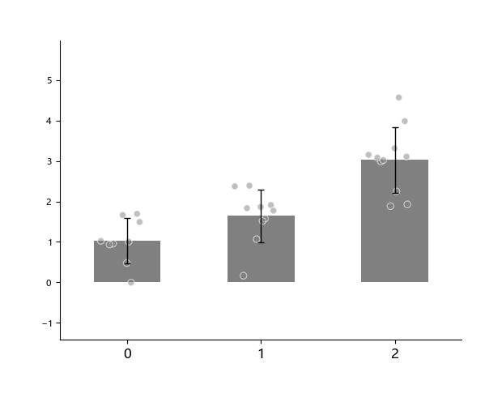

## Multiple Subplots

With `matplotlib`, we can pre-create `figure` and `axes` externally, allowing flexible plotting of multiple subplots and achieving more complex graphic layouts.
For more advanced subplot layout methods, please refer to the [matplotlib tutorial](https://matplotlib.org/stable/users/explain/axes/mosaic.html).

```python
import numpy as np
import matplotlib.pyplot as plt
from plotfig import *

ax1_bar1 = np.random.normal(0, 1, 7)
ax1_bar2 = np.random.normal(0, 1, 8)
ax2_bar1 = np.random.normal(0, 1, 9)
ax2_bar2 = np.random.normal(0, 1, 10)

fig, axes = plt.subplots(1, 2, figsize=(6, 3))
fig.subplots_adjust()

ax1 = plot_one_group_bar_figure([ax1_bar1, ax1_bar2], ax=axes.flatten()[0])
ax2 = plot_one_group_bar_figure([ax2_bar1, ax2_bar2], ax=axes.flatten()[1])
```

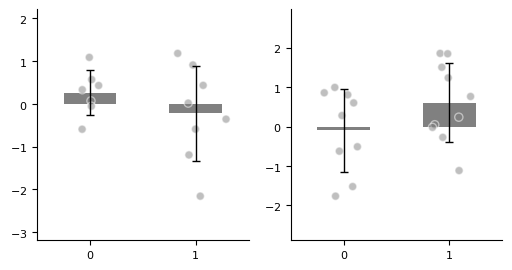

More `axes`.

```python
import numpy as np
import matplotlib.pyplot as plt
from plotfig import *

ax1_bar1 = np.random.normal(3, 1, 7)
ax1_bar2 = np.random.normal(3, 1, 8)
ax2_bar1 = np.random.normal(3, 1, 9)
ax2_bar2 = np.random.normal(3, 1, 10)
ax3_bar1 = np.random.normal(3, 1, 9)
ax3_bar2 = np.random.normal(3, 1, 10)
ax4_bar1 = np.random.normal(3, 1, 9)
ax4_bar2 = np.random.normal(3, 1, 10)

fig, axes = plt.subplots(2, 2, figsize=(6, 6))
fig.subplots_adjust(wspace=0.5, hspace=0.5)
ax1 = plot_one_group_bar_figure([ax1_bar1, ax1_bar2], ax=axes[0,0], labels_name=["A", "B"])
ax2 = plot_one_group_bar_figure([ax2_bar1, ax2_bar2], ax=axes[0,1], labels_name=["C", "D"])
ax3 = plot_one_group_bar_figure([ax3_bar1, ax3_bar2], ax=axes[1,0], labels_name=["E", "F"])
ax4 = plot_one_group_bar_figure([ax4_bar1, ax4_bar2], ax=axes[1,1], labels_name=["G", "H"])
```

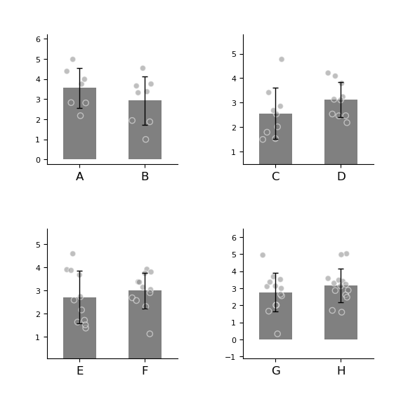

## Plot Beautification

### Parameter Settings

We can create a `fig` object externally to flexibly control the image size.
`plotfig` provides rich options for customizing chart styles.
Below is an example usage of some common parameters in the `plot_one_group_bar_figure` function.

For complete parameter descriptions, please refer to the API documentation for [`plot_one_group_bar_figure`](../api/#plotfig.bar.plot_one_group_bar_figure).

```python
import numpy as np
import matplotlib.pyplot as plt
from plotfig import *

data1 = np.random.normal(7, 1, 10)
data2 = np.random.normal(8, 1, 9)

fig, ax = plt.subplots(figsize=(3, 3))
ax = plot_one_group_bar_figure(
    [data1, data2],
    ax=ax,
    labels_name=["A", "B"],
    x_label_name="x",
    y_label_name="y",
    title_name="Title name",
    title_fontsize=15,
    width=0.5,
    dots_size=15,
    colors=["#4573a5", "orange"],
    color_alpha=0.7,
    errorbar_type="sd",
    edgecolor="r",
)
```

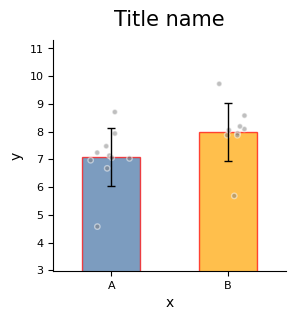

`plot_one_group_bar_figure` supports drawing bar charts in gradient color style, suitable for displaying correlation results between different objects.

For example, when we calculate the Spearman correlation of structural connections between homologous brain regions (total 20) of "human-chimpanzee, human-macaque, chimpanzee-macaque", we can consider using this method for visualization.

```python
import numpy as np
import matplotlib.pyplot as plt
from plotfig import *

human_color = "#e38a48"
chimp_color = "#919191"
macaque_color = "#4573a5"

np.random.seed(42)
human_chimp = np.random.normal(7, 1, 20)
human_macaque = np.random.normal(7, 1, 20)
chimp_macaque = np.random.normal(7, 1, 20)

fig, ax = plt.subplots(figsize=(5,5))
ax = plot_one_group_bar_figure(
    [human_chimp, human_macaque, chimp_macaque],
    ax=ax,
    labels_name=["Human-Chimp", "Human-Macaque", "Chimp-Macaque"],
    y_label_name="Spearman correlation",
    width=0.7,
    errorbar_type="sd",
    gradient_color=True,
    colors_start= [human_color, human_color, chimp_color],
    colors_end= [chimp_color, macaque_color, macaque_color]
)
```

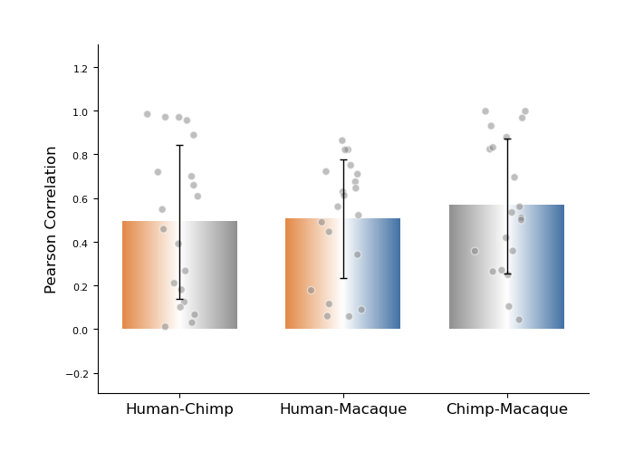

### About X Axis

When x-axis labels are long, you can rotate them to avoid overlap and improve readability.

```python
import numpy as np
import matplotlib.pyplot as plt
from plotfig import *

# Set Chinese font
plt.rcParams['font.family'] = "Microsoft YaHei"  # Microsoft YaHei
plt.rcParams['axes.unicode_minus'] = False  # Correctly display minus sign

data1 = np.random.normal(3, 1, 10)
data2 = np.random.normal(4, 1, 9)

fig, axes = plt.subplots(1, 2, figsize=(6, 3))
fig.subplots_adjust(wspace=0.5)
ax1 = plot_one_group_bar_figure(
    [data1, data2],
    ax=axes[0],
    labels_name=["AAAAAAAAAAA", "BBBBBBBBBB"],
    y_label_name="y",
    title_name="名字过长",
    title_fontsize=15,
)
ax2 = plot_one_group_bar_figure(
    [data1, data2],
    ax=axes[1],
    labels_name=["AAAAAAAAAAA", "BBBBBBBBBB"],
    y_label_name="y",
    title_name="锚定中间旋转",
    title_fontsize=15,
    x_tick_rotation=10,
    x_label_ha="center",
)
```

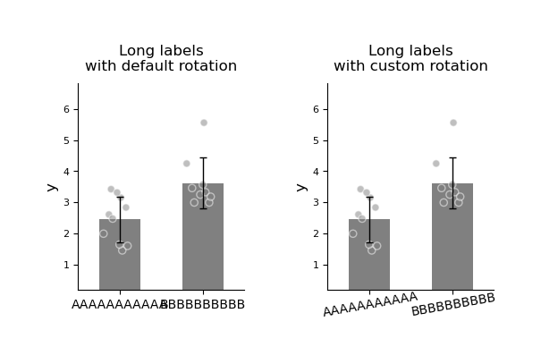

### About Y Axis

`plot_one_group_bar_figure` automatically calculates the distance between the highest and lowest points by default, and sets it to 0.618 (the golden ratio) of the y-axis length to optimize visual effects.
If you want to manually set the y-axis range, you can use the `y_lim` parameter to customize it.

```python
import numpy as np
import matplotlib.pyplot as plt
from plotfig import *

# Set Chinese font
plt.rcParams['font.family'] = "Microsoft YaHei"  # Microsoft YaHei
plt.rcParams['axes.unicode_minus'] = False  # Correctly display minus sign

data1 = np.random.normal(3, 1, 10)
data2 = np.random.normal(4, 1, 9)

fig, axes = plt.subplots(1, 2, figsize=(6, 3))
fig.subplots_adjust(wspace=0.5)
ax1 = plot_one_group_bar_figure(
    [data1, data2],
    ax=axes[0],
    labels_name=["A", "B"],
    y_label_name="y",
    title_name="黄金比例显示",
    title_fontsize=15,
)
ax2 = plot_one_group_bar_figure(
    [data1, data2],
    ax=axes[1],
    labels_name=["A", "B"],
    y_label_name="y",
    title_name="手动设置y轴",
    title_fontsize=15,
    y_lim=(2, 6)  # Set y-axis range
)
```


Sometimes we want to fix the bottom of the ax to 0, but are not sure of the specific value of the maximum tick. We can use `ax_bottom_is_0` to set the bottom of the ax to 0.

```python
import numpy as np
import matplotlib.pyplot as plt
from plotfig import *

# Set Chinese font
plt.rcParams['font.family'] = "Microsoft YaHei"  # Microsoft YaHei
plt.rcParams['axes.unicode_minus'] = False  # Correctly display minus sign

data1 = np.random.normal(1,  1, 10)
data2 = np.random.normal(2, 1, 9)

fig, axes = plt.subplots(1, 2, figsize=(6, 3))
fig.subplots_adjust(wspace=0.5)
ax1 = plot_one_group_bar_figure(
    [data1, data2],
    ax=axes[0],
    labels_name=["A", "B"],
    y_label_name="y",
    title_name="黄金比例显示",
    title_fontsize=15,
)
ax2 = plot_one_group_bar_figure(
    [data1, data2],
    ax=axes[1],
    labels_name=["A", "B"],
    y_label_name="y",
    title_name="不显示负值",
    title_fontsize=15,
    ax_bottom_is_0=True,  # Do not display negative values
)
```

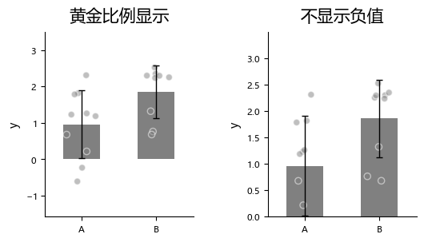

Sometimes we want to limit the maximum value of the y-axis ticks to 1. For example, when the y-axis represents correlation coefficients after Fisher z transformation, we can set `y_max_tick_to_one` to fix the maximum value of the y-axis ticks to 1.

```python
import numpy as np
import matplotlib.pyplot as plt
from plotfig import *

# Set Chinese font
plt.rcParams['font.family'] = "Microsoft YaHei"  # Microsoft YaHei
plt.rcParams['axes.unicode_minus'] = False  # Correctly display minus sign

data1 = np.random.normal(0.9,  0.1, 10)
data2 = np.random.normal(0.9, 0.1, 9)

fig, axes = plt.subplots(1, 2, figsize=(6, 3))
fig.subplots_adjust(wspace=0.5)
ax1 = plot_one_group_bar_figure(
    [data1, data2],
    ax=axes[0],
    labels_name=["A", "B"],
    y_label_name="y",
    title_name="黄金比例显示",
    title_fontsize=15,
)
ax2 = plot_one_group_bar_figure(
    [data1, data2],
    ax=axes[1],
    labels_name=["A", "B"],
    y_label_name="y",
    title_name="y轴最大刻度取1",
    title_fontsize=15,
    y_max_tick_is_1=True,  # y-axis maximum tick takes 1
)
```

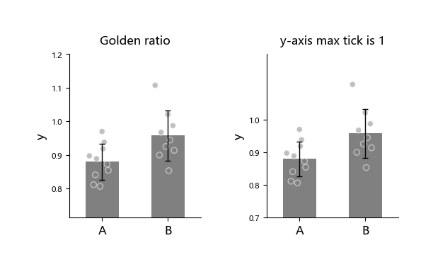

Sometimes we may want to change the display format of the y-axis, for example using scientific notation to present values. We can use the `math_text` parameter to set it.

```python
import numpy as np
import matplotlib.pyplot as plt
from plotfig import *

# Set Chinese font
plt.rcParams['font.family'] = "Microsoft YaHei"  # Microsoft YaHei
plt.rcParams['axes.unicode_minus'] = False  # Correctly display minus sign

data1 = np.random.normal(10000, 1000, 10)
data2 = np.random.normal(11000, 1000, 9)
data3 = np.random.normal(0.0001, 0.0001, 11)
data4 = np.random.normal(0.0001, 0.0001, 12)

fig, axes = plt.subplots(2, 2, figsize=(6, 6))
fig.subplots_adjust(wspace=0.5, hspace=0.5)
ax1 = plot_one_group_bar_figure(
    [data1, data2],
    ax=axes[0,0],
    labels_name=["A", "B"],
    y_label_name="y",
    title_name="科学计数法",
    title_fontsize=15,
)  # y-axis uses scientific notation by default
ax2 = plot_one_group_bar_figure(
    [data1, data2],
    ax=axes[0,1],
    labels_name=["A", "B"],
    y_label_name="y",
    title_name="无科学计数法",
    title_fontsize=15,
    math_text=False,  # Manually turn off scientific notation
)
ax3 = plot_one_group_bar_figure(
    [data3, data4],
    ax=axes[1,0],
    labels_name=["A", "B"],
    y_label_name="y",
    title_name="科学计数法",
    title_fontsize=15,
)  # y-axis uses scientific notation by default
ax4 = plot_one_group_bar_figure(
    [data3, data4],
    ax=axes[1,1],
    labels_name=["A", "B"],
    y_label_name="y",
    title_name="无科学计数法",
    title_fontsize=15,
    math_text=False,  # Manually turn off scientific notation
)
```

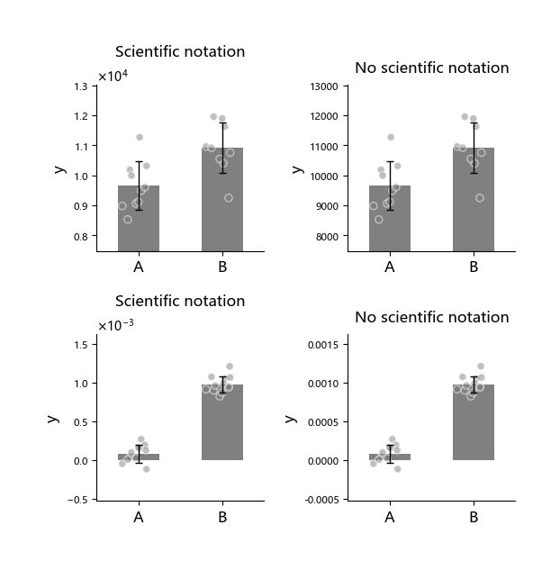

Sometimes we want to display the Y axis in percentage format.

!!! warning
    `percentage` format conflicts with `math_text`.
    And `math_text` is enabled by default and needs to be explicitly disabled.

```python
import numpy as np
import matplotlib.pyplot as plt
from plotfig import *

# Set Chinese font
plt.rcParams['font.family'] = "Microsoft YaHei"  # Microsoft YaHei
plt.rcParams['axes.unicode_minus'] = False  # Correctly display minus sign

data1 = np.random.normal(0.5,  0.1, 10)
data2 = np.random.normal(0.5, 0.1, 9)

fig, axes = plt.subplots(1, 2, figsize=(6, 3))
fig.subplots_adjust(wspace=0.5)
ax1 = plot_one_group_bar_figure(
    [data1, data2],
    ax=axes[0],
    labels_name=["A", "B"],
    y_label_name="y",
    title_name="常规显示",
    title_fontsize=15,
)
ax2 = plot_one_group_bar_figure(
    [data1, data2],
    ax=axes[1],
    labels_name=["A", "B"],
    y_label_name="y",
    title_name="显示百分比",
    title_fontsize=15,
    math_text=False,
    percentage=True,
)
```

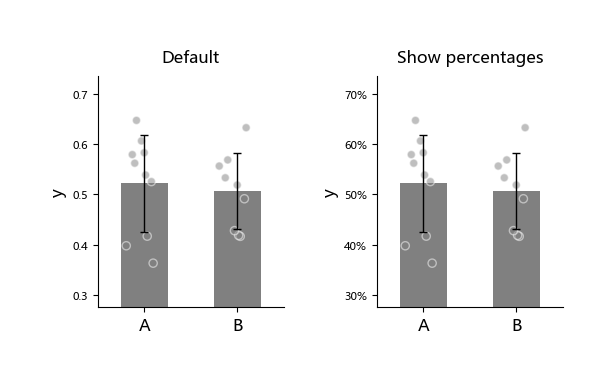

### About Scatter Points

`plot_one_group_bar_figure` allows assigning colors to each scatter point, commonly used to distinguish data from different sources.

```python
import numpy as np
import matplotlib.pyplot as plt
from plotfig import *

# Set Chinese font
plt.rcParams['font.family'] = "Microsoft YaHei"  # Microsoft YaHei
plt.rcParams['axes.unicode_minus'] = False  # Correctly display minus sign

data1 = np.random.normal(0.5,  0.1, 10)
data2 = np.random.normal(0.5, 0.1, 9)
dots_color1 = [["blue"]*10, ["red"]*9]
dots_color2 = [["green"]*5+["pink"]*5, ["orange"]*4+["purple"]*5]

fig, axes = plt.subplots(1, 2, figsize=(6, 3))
fig.subplots_adjust(wspace=0.5)
ax1 = plot_one_group_bar_figure(
    [data1, data2],
    ax=axes[0],
    labels_name=["A", "B"],
    y_label_name="y",
    title_name="散点统一颜色",
    title_fontsize=15,
    dots_color=dots_color1,  # Scatter point colors
)
ax2 = plot_one_group_bar_figure(
    [data1, data2],
    ax=axes[1],
    labels_name=["A", "B"],
    y_label_name="y",
    title_name="散点各自分配颜色",
    title_fontsize=15,
    dots_color=dots_color2,  # Scatter point colors
)
```

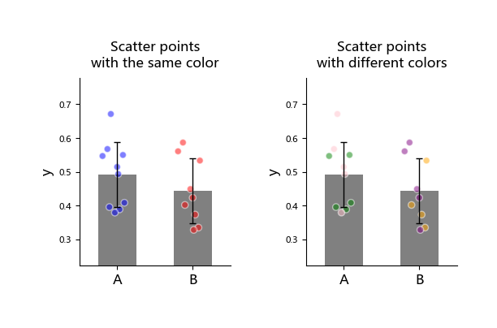

## Statistics

`plot_one_group_bar_figure` can quickly implement statistical comparisons between bars. Currently supports the following statistical methods:

1. Independent samples t-test (`ttest_ind`)
2. Paired samples t-test (`ttest_rel`)
3. One-sample t-test (`ttest_1samp`)
4. Mann-Whitney U test (`mannwhitneyu`)
5. External statistical test (`external`)

When using, you need to first enable the statistical function through the `statistic` option and specify the method name in `test_method`.

```python
import numpy as np
import matplotlib.pyplot as plt
from plotfig import *

# Set Chinese font
plt.rcParams['font.family'] = "Microsoft YaHei"  # Microsoft YaHei
plt.rcParams['axes.unicode_minus'] = False  # Correctly display minus sign

np.random.seed(42)
data1 = np.random.normal(3, 1, 30)
data2 = np.random.normal(4, 1, 31)
data3 = np.random.normal(5, 1, 31)
data4 = np.random.normal(2, 1, 9)
data5 = np.random.normal(4, 1, 10)
data6 = np.random.normal(0, 1, 20)
data7 = np.random.normal(1, 1, 20)

fig, axes = plt.subplots(2, 2, figsize=(6, 6))
fig.subplots_adjust(wspace=0.5, hspace=0.5)
ax1 = plot_one_group_bar_figure(
    [data1, data2],
    ax=axes[0,0],
    labels_name=["A", "B"],
    y_label_name="y",
    title_name="独立样本t检验",
    title_fontsize=15,
    statistic=True,
    test_method=["ttest_ind"]
)
ax2 = plot_one_group_bar_figure(
    [data2, data3],
    ax=axes[0,1],
    labels_name=["A", "B"],
    y_label_name="y",
    title_name="配对样本t检验",
    title_fontsize=15,
    statistic=True,
    test_method=["ttest_rel"]
)
ax3 = plot_one_group_bar_figure(
    [data6, data7],
    ax=axes[1,0],
    labels_name=["A", "B"],
    y_label_name="y",
    title_name="单样本t检验",
    title_fontsize=15,
    statistic=True,
    test_method=["ttest_1samp"],
    popmean=0,
)
ax4 = plot_one_group_bar_figure(
    [data4, data5],
    ax=axes[1,1],
    labels_name=["A", "B"],
    y_label_name="y",
    title_name="Mann-Whitney U检验",
    title_fontsize=15,
    statistic=True,
    test_method=["mannwhitneyu"]
)
```

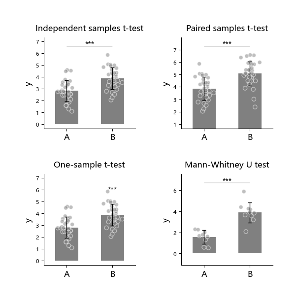

"External statistical test" (`external`) means users can use other statistical software to complete the test and only need to pass the calculated p-values to the function.
External statistical tests need to pass the corresponding p-value list through `p_list`.

!!! note
    When using "external statistical test" and there are multiple bars to compare, the passed *p* values should follow the following order:

    - 1 → 2, 1 → 3, …, 1 → n
    - 2 → 3, 2 → 4, …, 2 → n
    - And so on

```python
import numpy as np
import matplotlib.pyplot as plt
from plotfig import *

# Set Chinese font
plt.rcParams['font.family'] = "Microsoft YaHei"  # Microsoft YaHei
plt.rcParams['axes.unicode_minus'] = False  # Correctly display minus sign

np.random.seed(42)
data1 = np.random.normal(5,  1, 20)
data2 = np.random.normal(7, 1, 20)
data3 = np.random.normal(7, 1, 20)
data4 = np.random.normal(9, 1, 20)

p_list = [0.05, 0.01, 0.001, 1, 0.05, 0.01]

fig, ax = plt.subplots(figsize=(6, 6))
ax = plot_one_group_bar_figure(
    [data1, data2, data3, data4],
    ax=ax,
    y_label_name="y",
    title_name="外部检验",
    title_fontsize=15,
    statistic=True,
    test_method=["external"],
    p_list=p_list,
)
```

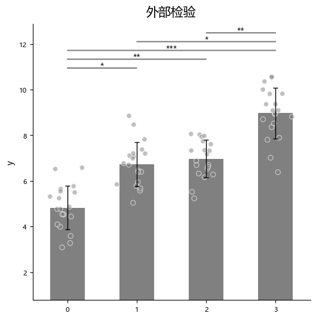

# Single Group Violin Plot

Violin plot is a visualization tool that combines the characteristics of box plot and kernel density estimation plot, used to display the distribution of data.
It not only displays statistical information such as median and quartiles of the data, but also intuitively reflects the distribution shape of data in different value ranges through symmetric kernel density curves.
Compared with traditional box plots, violin plots can more comprehensively reveal features such as multimodality and skewness of data, suitable for comparing distribution differences between multiple groups.
When data distribution is uneven and non-parametric statistical methods are adopted, using violin plots is often more appropriate.

In plotfig, the function for drawing violin plots is named `plot_one_group_violin_figure`.
Most of its parameters are similar to `plot_one_group_bar_figure`. Below are some demonstrations.

For complete parameter descriptions, please refer to the API documentation for [`plot_one_group_violin_figure`](../api/#plotfig.bar.plot_one_group_violin_figure).

```python
import numpy as np
import matplotlib.pyplot as plt
from plotfig import *

human_color = "#e38a48"
chimp_color = "#919191"
macaque_color = "#4573a5"

np.random.seed(42)
human_chimp = 1 + np.random.normal(0, 1, 100)
human_macaque = 2 + np.random.normal(0, 1, 100)
chimp_macaque = 3 + np.random.normal(0, 1, 100)

fig, ax = plt.subplots(figsize=(5,5))
ax = plot_one_group_violin_figure(
    [human_chimp, human_macaque, chimp_macaque],
    ax=ax,
    labels_name=["Human-Chimp", "Human-Macaque", "Chimp-Macaque"],
    y_label_name="Spearman correlation",
    width=0.7,
    gradient_color=True,
    colors_start= [human_color, human_color, chimp_color],
    colors_end= [chimp_color, macaque_color, macaque_color],
    show_dots=True,
    dots_size=7,
    statistic=True,
    test_method=["mannwhitneyu"]
)
```

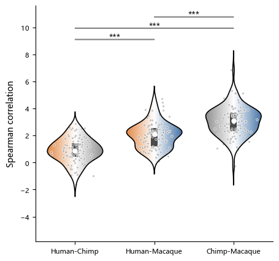
