# Single Group Bar Chart

## Quick Plot

A bar chart is a commonly used graphical tool for showing numerical comparisons between different categories.
It represents each category using a set of vertical or horizontal rectangular bars, where bar height (or length) corresponds to data magnitude.
Bar charts are intuitive and clear, making them suitable for comparing group means, especially for visualizing discrete categorical data.
In scientific research and data analysis, bar charts are often used to present differences between experimental and control groups.
`plotfig` is built on the powerful `matplotlib`, simplifying plotting workflows and making multi-group comparison more straightforward.

For example, we have 3 groups of data (with 9, 10, and 11 samples respectively), and we use a bar chart to show their differences.


```python
import numpy as np
from plotfig import plot_one_group_bar_figure

data1 = np.random.normal(1, 1, 9)
data2 = np.random.normal(2, 1, 10)
data3 = np.random.normal(3, 1, 11)

ax = plot_one_group_bar_figure([data1, data2, data3])
```


    
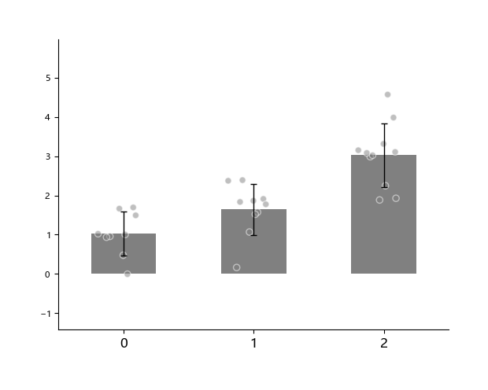
    


## Multiple Subplots

With `matplotlib`, we can create `figure` and `axes` externally in advance, so we can flexibly draw multiple subplots and achieve more complex layouts.
For more advanced subplot layout methods, see the [matplotlib tutorial](https://matplotlib.org/stable/users/explain/axes/mosaic.html).


```python
import numpy as np
import matplotlib.pyplot as plt
from plotfig import plot_one_group_bar_figure

ax1_bar1 = np.random.normal(0, 1, 7)
ax1_bar2 = np.random.normal(0, 1, 8)
ax2_bar1 = np.random.normal(0, 1, 9)
ax2_bar2 = np.random.normal(0, 1, 10)

fig, axes = plt.subplots(1, 2, figsize=(6, 3))

ax1 = plot_one_group_bar_figure([ax1_bar1, ax1_bar2], ax=axes[0])
ax2 = plot_one_group_bar_figure([ax2_bar1, ax2_bar2], ax=axes[1])
```


    
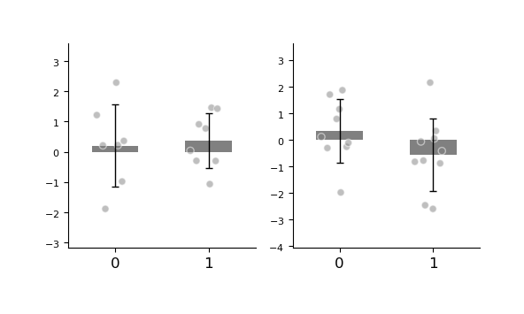
    


More `axes`.


```python
import numpy as np
import matplotlib.pyplot as plt
from plotfig import plot_one_group_bar_figure

ax1_bar1 = np.random.normal(3, 1, 7)
ax1_bar2 = np.random.normal(3, 1, 8)
ax2_bar1 = np.random.normal(3, 1, 9)
ax2_bar2 = np.random.normal(3, 1, 10)
ax3_bar1 = np.random.normal(3, 1, 11)
ax3_bar2 = np.random.normal(3, 1, 12)
ax4_bar1 = np.random.normal(3, 1, 13)
ax4_bar2 = np.random.normal(3, 1, 14)


fig, axes = plt.subplots(2, 2, figsize=(6, 6))
fig.subplots_adjust(wspace=0.5, hspace=0.5)

ax1 = plot_one_group_bar_figure([ax1_bar1, ax1_bar2], ax=axes[0,0], labels_name=["A", "B"])
ax2 = plot_one_group_bar_figure([ax2_bar1, ax2_bar2], ax=axes[0,1], labels_name=["C", "D"])
ax3 = plot_one_group_bar_figure([ax3_bar1, ax3_bar2], ax=axes[1,0], labels_name=["E", "F"])
ax4 = plot_one_group_bar_figure([ax4_bar1, ax4_bar2], ax=axes[1,1], labels_name=["G", "H"])
```


    
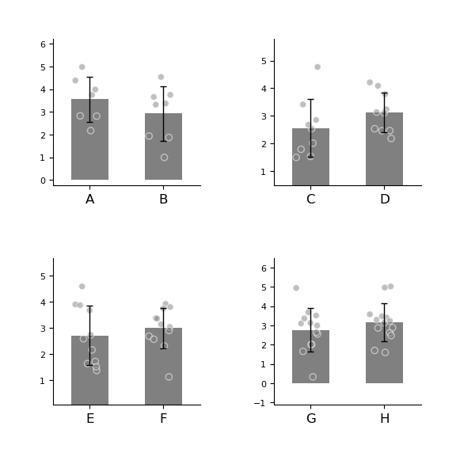
    


## Plot Beautification

### Parameter Settings

We can create a `fig` object externally to flexibly control figure size.
`plotfig` provides rich options for customizing plot styles.
Below is an example showing some commonly used parameters of `plot_one_group_bar_figure`.

For complete parameter descriptions, see the API documentation for [`plot_one_group_bar_figure`](../api/#plotfig.single_bar.plot_one_group_bar_figure).


```python
import numpy as np
import matplotlib.pyplot as plt
from plotfig import plot_one_group_bar_figure

data1 = np.random.normal(7, 1, 10)
data2 = np.random.normal(8, 1, 9)

fig, ax = plt.subplots(figsize=(3, 3))

ax = plot_one_group_bar_figure(
    [data1, data2],
    ax=ax,
    labels_name=["A", "B"],
    x_label_name="x",
    y_label_name="y",
    title_name="Title name",
    title_fontsize=15,
    width=0.8,
    show_dots=True,
    dots_size=15,
    colors=["#4573a5", "orange"],
    color_alpha=0.7,
    errorbar_type="sd",
)
```


    
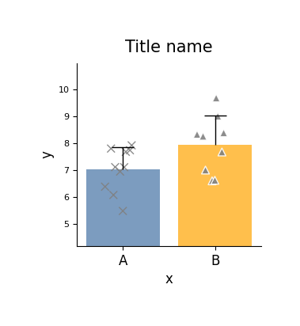
    


`plot_one_group_bar_figure` supports rendering bars with gradient colors, which is suitable for showing associations between different objects.

For example, when we compute Pearson correlations of structural connectivity across homologous brain regions (20 in total) among “human-chimpanzee, human-macaque, chimpanzee-macaque,” this style can be used for visualization.


```python
import numpy as np
import matplotlib.pyplot as plt
from plotfig import plot_one_group_bar_figure


human_color = "#e38a48"
chimp_color = "#919191"
macaque_color = "#4573a5"

human_chimp = np.random.random(20)
human_macaque = np.random.random(20)
chimp_macaque = np.random.random(20)

fig, ax = plt.subplots(figsize=(7, 5))

ax = plot_one_group_bar_figure(
    [human_chimp, human_macaque, chimp_macaque],
    ax=ax,
    labels_name=["Human-Chimp", "Human-Macaque", "Chimp-Macaque"],
    y_label_name="Pearson Correlation",
    width=0.7,
    gradient_color=True,
    colors_start=[human_color, human_color, chimp_color],
    colors_end=[chimp_color, macaque_color, macaque_color],
)
```


    
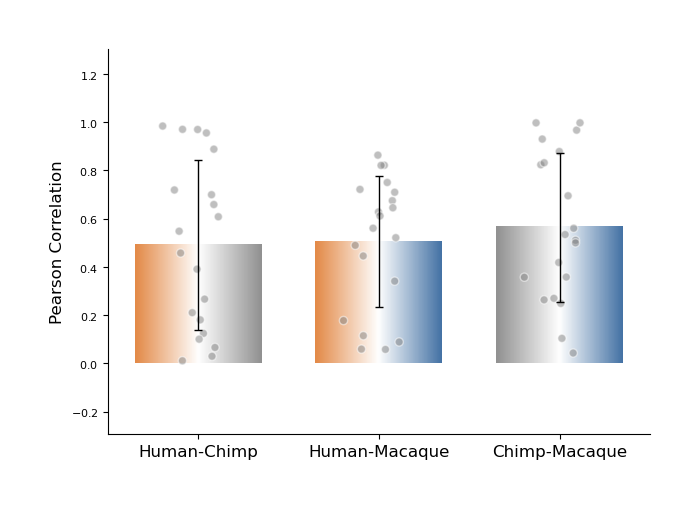
    


### About the X Axis

When x-axis labels are long, you can rotate them to avoid overlap and improve readability.


```python
import numpy as np
import matplotlib.pyplot as plt
from plotfig import plot_one_group_bar_figure

data1 = np.random.normal(3, 1, 10)
data2 = np.random.normal(4, 1, 9)

fig, axes = plt.subplots(1, 2, figsize=(6, 3))
fig.subplots_adjust(wspace=0.5)

ax1 = plot_one_group_bar_figure(
    [data1, data2],
    ax=axes[0],
    x_tick_fontsize=10,
    labels_name=["AAAAAAAAAAA", "BBBBBBBBBB"],
    y_label_name="y",
    title_name="Long labels\nwith default rotation",
)
ax2 = plot_one_group_bar_figure(
    [data1, data2],
    ax=axes[1],
    x_tick_fontsize=10,
    labels_name=["AAAAAAAAAAA", "BBBBBBBBBB"],
    y_label_name="y",
    title_name="Long labels\nwith custom rotation",
    x_tick_rotation=10,
    x_label_ha="center",
)
```


    
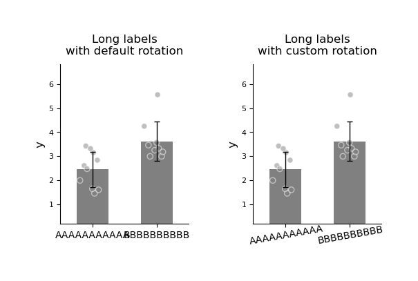
    


### About the Y Axis

By default, `plot_one_group_bar_figure` automatically computes the distance between the highest and lowest points and sets it to 0.618 (the golden ratio) of the y-axis span to optimize visual appearance.
If you want to manually set the y-axis range, you can use `y_lim`.


```python
import numpy as np
import matplotlib.pyplot as plt
from plotfig import plot_one_group_bar_figure

data1 = np.random.normal(3, 1, 10)
data2 = np.random.normal(4, 1, 9)

fig, axes = plt.subplots(1, 2, figsize=(6, 3))
fig.subplots_adjust(wspace=0.5)

ax1 = plot_one_group_bar_figure(
    [data1, data2],
    ax=axes[0],
    labels_name=["A", "B"],
    y_label_name="y",
    title_name="Golden ratio",
)
ax2 = plot_one_group_bar_figure(
    [data1, data2],
    ax=axes[1],
    labels_name=["A", "B"],
    y_label_name="y",
    title_name="Custom y-axis limit",
    y_lim=(2, 6)
)
```


    
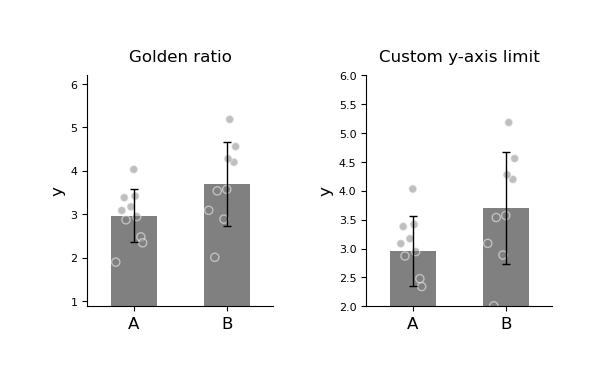
    


Sometimes we want to fix the bottom of the axis at 0, but we are not sure about the exact maximum tick value. In that case, use `ax_bottom_is_0`.


```python
import numpy as np
import matplotlib.pyplot as plt
from plotfig import plot_one_group_bar_figure

data1 = np.random.normal(1,  1, 10)
data2 = np.random.normal(2, 1, 9)

fig, axes = plt.subplots(1, 2, figsize=(6, 3))
fig.subplots_adjust(wspace=0.5)

ax1 = plot_one_group_bar_figure(
    [data1, data2],
    ax=axes[0],
    labels_name=["A", "B"],
    y_label_name="y",
    title_name="Golden ratio",
)
ax2 = plot_one_group_bar_figure(
    [data1, data2],
    ax=axes[1],
    labels_name=["A", "B"],
    y_label_name="y",
    title_name="No negative values",
    ax_bottom_is_0=True,
)
```


    
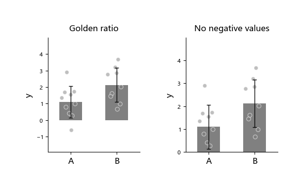
    


Sometimes we want to constrain the maximum y-axis tick to 1. For example, when the y-axis represents Fisher z-transformed correlation coefficients, you can set `y_max_tick_is_1` to force the maximum y-axis tick to 1.


```python
import numpy as np
import matplotlib.pyplot as plt
from plotfig import plot_one_group_bar_figure

data1 = np.random.normal(0.9, 0.1, 10)
data2 = np.random.normal(0.9, 0.1, 9)

fig, axes = plt.subplots(1, 2, figsize=(6, 3))
fig.subplots_adjust(wspace=0.5)

ax1 = plot_one_group_bar_figure(
    [data1, data2],
    ax=axes[0],
    labels_name=["A", "B"],
    y_label_name="y",
    title_name="Golden ratio",
)
ax2 = plot_one_group_bar_figure(
    [data1, data2],
    ax=axes[1],
    labels_name=["A", "B"],
    y_label_name="y",
    title_name="y-axis max tick is 1",
    y_max_tick_is_1=True,
)
```


    
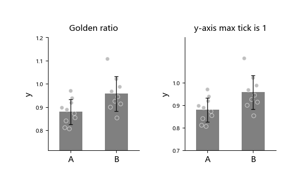
    


Sometimes we may want to change y-axis number formatting, for example using scientific notation. You can control this with `math_text`.


```python
import numpy as np
import matplotlib.pyplot as plt
from plotfig import plot_one_group_bar_figure

data1 = np.random.normal(10000, 1000, 10)
data2 = np.random.normal(11000, 1000, 9)
data3 = np.random.normal(0.0001, 0.0001, 11)
data4 = np.random.normal(0.001, 0.0001, 12)

fig, axes = plt.subplots(2, 2, figsize=(6, 6))
fig.subplots_adjust(wspace=0.5, hspace=0.5)

ax1 = plot_one_group_bar_figure(
    [data1, data2],
    ax=axes[0,0],
    labels_name=["A", "B"],
    y_label_name="y",
    title_name="Scientific notation",
)
ax2 = plot_one_group_bar_figure(
    [data1, data2],
    ax=axes[0,1],
    labels_name=["A", "B"],
    y_label_name="y",
    title_name="No scientific notation",
    math_text=False,
)
ax3 = plot_one_group_bar_figure(
    [data3, data4],
    ax=axes[1,0],
    labels_name=["A", "B"],
    y_label_name="y",
    title_name="Scientific notation",
)
ax4 = plot_one_group_bar_figure(
    [data3, data4],
    ax=axes[1,1],
    labels_name=["A", "B"],
    y_label_name="y",
    title_name="No scientific notation",
    math_text=False,
)
```


    
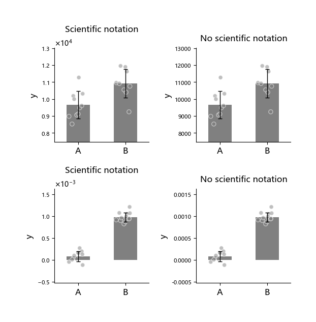
    


Sometimes we want to display the Y axis in percentage format.

!!! warning
    `percentage` format conflicts with `math_text`.
    Since `math_text` is enabled by default, you need to explicitly disable it.


```python
import numpy as np
import matplotlib.pyplot as plt
from plotfig import plot_one_group_bar_figure

data1 = np.random.normal(0.5,  0.1, 10)
data2 = np.random.normal(0.5, 0.1, 9)

fig, axes = plt.subplots(1, 2, figsize=(6, 3))
fig.subplots_adjust(wspace=0.5)

ax1 = plot_one_group_bar_figure(
    [data1, data2],
    ax=axes[0],
    labels_name=["A", "B"],
    y_label_name="y",
    title_name="Default",
)
ax2 = plot_one_group_bar_figure(
    [data1, data2],
    ax=axes[1],
    labels_name=["A", "B"],
    y_label_name="y",
    title_name="Show percentages",
    math_text=False,
    percentage=True,
)
```


    
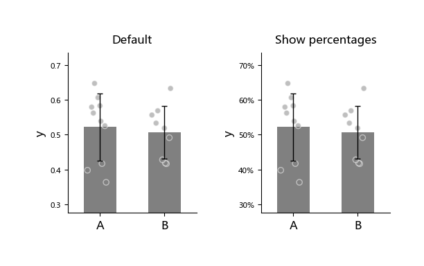
    


### About Scatter Points

`plot_one_group_bar_figure` allows assigning colors to each scatter point, which can be used to distinguish data from different sources.


```python
import numpy as np
import matplotlib.pyplot as plt
from plotfig import plot_one_group_bar_figure

data1 = np.random.normal(0.5,  0.1, 10)
data2 = np.random.normal(0.5, 0.1, 9)

dots_color1 = [["blue"]*10, ["red"]*9]
dots_color2 = [["green"]*5+["pink"]*5, ["orange"]*4+["purple"]*5]

fig, axes = plt.subplots(1, 2, figsize=(6, 3))
fig.subplots_adjust(wspace=0.5)

ax1 = plot_one_group_bar_figure(
    [data1, data2],
    ax=axes[0],
    labels_name=["A", "B"],
    y_label_name="y",
    title_name="Scatter points\nwith the same color",
    dots_color=dots_color1,  # scatter point colors
)
ax2 = plot_one_group_bar_figure(
    [data1, data2],
    ax=axes[1],
    labels_name=["A", "B"],
    y_label_name="y",
    title_name="Scatter points\nwith different colors",
    dots_color=dots_color2,
)
```


    
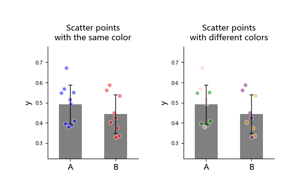
    


## Statistics

`plot_one_group_bar_figure` can quickly perform between-bar statistical comparison. Currently supported methods are:

1. Independent-samples t-test (`ttest_ind`)
2. Paired-samples t-test (`ttest_rel`)
3. One-sample t-test (`ttest_1samp`)
4. Mann-Whitney U test (`mannwhitneyu`)
5. External statistical test (`external`)

To use statistics, first enable it via `statistic`, then specify method names in `test_method`.


```python
import numpy as np
import matplotlib.pyplot as plt
from plotfig import plot_one_group_bar_figure

np.random.seed(42)

data1 = np.random.normal(3, 1, 30)
data2 = np.random.normal(4, 1, 31)
data3 = np.random.normal(5, 1, 31)
data4 = np.random.normal(2, 1, 9)
data5 = np.random.normal(4, 1, 10)

fig, axes = plt.subplots(2, 2, figsize=(6, 6))
fig.subplots_adjust(wspace=0.5, hspace=0.5)

ax1 = plot_one_group_bar_figure(
    [data1, data2],
    ax=axes[0,0],
    labels_name=["A", "B"],
    y_label_name="y",
    title_name="Independent samples t-test",
    statistic=True, 
    test_method=["ttest_ind"]
)
ax2 = plot_one_group_bar_figure(
    [data2, data3],
    ax=axes[0,1],
    labels_name=["A", "B"],
    y_label_name="y",
    title_name="Paired samples t-test",
    statistic=True, 
    test_method=["ttest_rel"]
)
ax3 = plot_one_group_bar_figure(
    [data1, data2],
    ax=axes[1,0],
    labels_name=["A", "B"],
    y_label_name="y",
    title_name="One-sample t-test",
    statistic=True,
    test_method=["ttest_1samp"],
    popmean=3,
)
ax4 = plot_one_group_bar_figure(
    [data4, data5],
    ax=axes[1,1],
    labels_name=["A", "B"],
    y_label_name="y",
    title_name="Mann-Whitney U test",
    statistic=True, 
    test_method=["mannwhitneyu"]
)
```


    
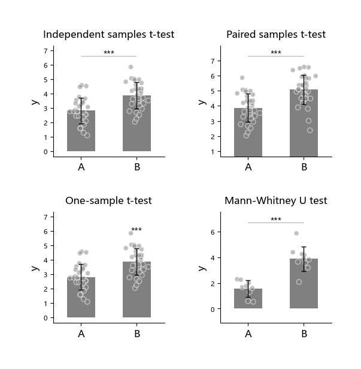
    


“External statistical test” (`external`) means users can run tests in other statistical software and only pass the resulting p-values into this function.
For external tests, you additionally pass the corresponding p-value list via `p_list`.

!!! note
    When using “external statistical test” with multiple bars to compare, the input *p* values should follow this order:

    - 1 -> 2, 1 -> 3, ..., 1 -> n  
    - 2 -> 3, 2 -> 4, ..., 2 -> n  
    - and so on


```python
import numpy as np
import matplotlib.pyplot as plt
from plotfig import plot_one_group_bar_figure

np.random.seed(42)

data1 = np.random.normal(5,  1, 20)
data2 = np.random.normal(7, 1, 20)
data3 = np.random.normal(7, 1, 20)
data4 = np.random.normal(9, 1, 20)

p_list = [0.05, 0.01, 0.001, 1, 0.05, 0.01]

fig, ax = plt.subplots(figsize=(6, 6))

ax = plot_one_group_bar_figure(
    [data1, data2, data3, data4],
    ax=ax,
    y_label_name="y",
    title_name="External test",
    statistic=True,
    test_method=["external"],
    p_list=p_list,
)
```


    
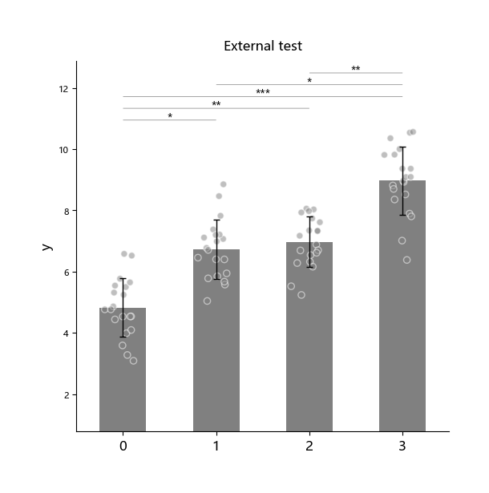
    


The following 4 tests can each be executed together with the one-sample t-test `ttest_1samp`:
1. Independent-samples t-test (`ttest_ind`)
2. Paired-samples t-test (`ttest_rel`)
3. Mann-Whitney U test (`mannwhitneyu`)
4. External statistical test (`external`)

That is, two tests are run in the same subplot.


```python
import numpy as np
import matplotlib.pyplot as plt
from plotfig import plot_one_group_bar_figure

np.random.seed(42)

data1 = np.random.normal(3, 1, 30)
data2 = np.random.normal(4, 1, 31)
data3 = np.random.normal(5, 1, 31)
data4 = np.random.normal(2, 1, 9)
data5 = np.random.normal(4, 1, 10)

fig, axes = plt.subplots(2, 2, figsize=(6, 6))
fig.subplots_adjust(wspace=0.5, hspace=0.5)

ax1 = plot_one_group_bar_figure(
    [data1, data2],
    ax=axes[0,0],
    labels_name=["A", "B"],
    y_label_name="y",
    title_name="Independent samples t-test",
    statistic=True, 
    test_method=["ttest_ind", "ttest_1samp"],
    popmean=0
)
ax2 = plot_one_group_bar_figure(
    [data2, data3],
    ax=axes[0,1],
    labels_name=["A", "B"],
    y_label_name="y",
    title_name="Paired samples t-test",
    statistic=True, 
    test_method=["ttest_rel", "ttest_1samp"],
    popmean=4,
)
ax3 = plot_one_group_bar_figure(
    [data4, data5],
    ax=axes[1,0],
    labels_name=["A", "B"],
    y_label_name="y",
    title_name="Mann-Whitney U test",
    statistic=True, 
    test_method=["mannwhitneyu", "ttest_1samp"],
    popmean=2,
)
ax4 = plot_one_group_bar_figure(
    [data1, data2],
    ax=axes[1,1],
    labels_name=["A", "B"],
    y_label_name="y",
    title_name="External test",
    statistic=True,
    test_method=["external", "ttest_1samp"],
    p_list=[0.05],
    popmean=0,
)
```


    
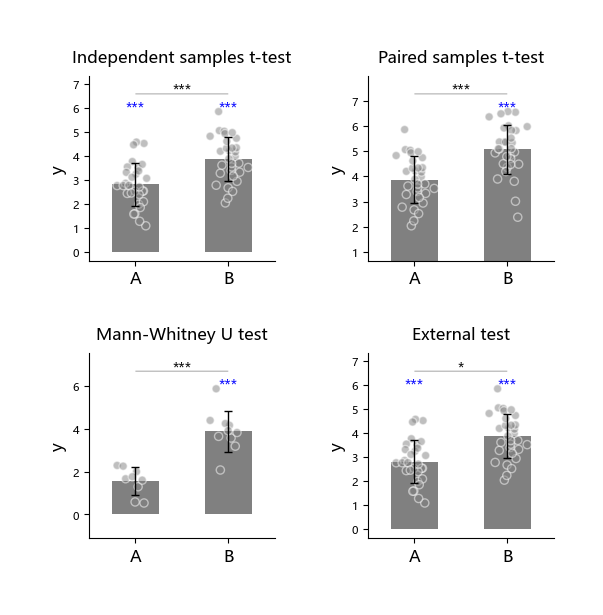
    


# Single Group Violin Plot

A violin plot is a visualization tool that combines characteristics of a box plot and a density plot, used to show data distributions.
It not only shows statistical information such as mean (white diamond), median (white line), and quartiles (black rectangle),
but also reflects distribution shape across value ranges through symmetric kernel density curves.

Compared with traditional box plots, violin plots can reveal multimodality and skewness more comprehensively, and are suitable for comparing distribution differences across groups.
When data are unevenly distributed and non-parametric methods are used, violin plots are often more appropriate.

In plotfig, the function for drawing violin plots is `plot_one_group_violin_figure`.
Most of its parameters are similar to `plot_one_group_bar_figure`; below is a partial demonstration.

For complete parameter descriptions, see the API documentation for [`plot_one_group_violin_figure`](../api/index.md/#plotfig.bar.plot_one_group_violin_figure).


```python
import numpy as np
import matplotlib.pyplot as plt
from plotfig import plot_one_group_violin_figure

human_color = "#e38a48"
chimp_color = "#919191"
macaque_color = "#4573a5"

np.random.seed(42)

human_chimp = 0.1 + np.random.normal(0, 0.1, 30)
human_macaque = 0.4 + np.random.normal(0, 0.1, 30)
chimp_macaque = 0.6 + np.random.normal(0, 0.1, 30)

fig, ax = plt.subplots(figsize=(5,5))

ax = plot_one_group_violin_figure(
    [human_chimp, human_macaque, chimp_macaque],
    ax=ax,
    labels_name=["Human-Chimp", "Human-Macaque", "Chimp-Macaque"],
    y_label_name="Pearson Correlation",
    width=0.9,
    show_dots=True,
    dots_size=10,
    gradient_color=True,
    colors_start= [human_color, human_color, chimp_color],
    colors_end= [chimp_color, macaque_color, macaque_color],
    statistic=True,
    test_method=["mannwhitneyu"]
)
```


    
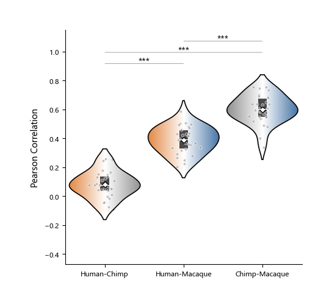
    

