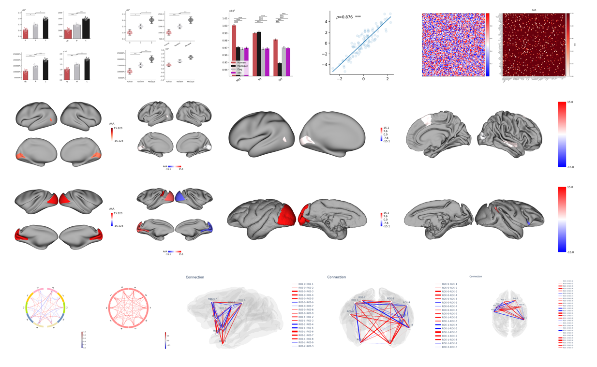

# plotfig

`plotfig`是一个用于认知神经领域科研绘图的python包。[^1]

[Github]网页看这里。

## 功能

主要包括图的种类：

1. bar图
2. 矩阵图
3. 相关图
4. 脑图
5. 圈状图（circos图）
6. 大脑连接图

[^1]:
    还没想好要引用什么，先写在这里怕自己忘了怎么写😨。

[GitHub]: https://github.com/ricardoryn/plotfig