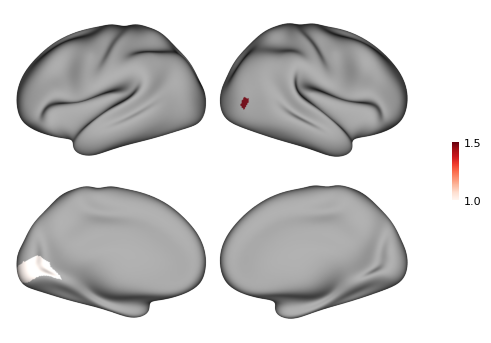
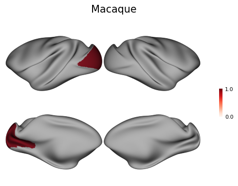
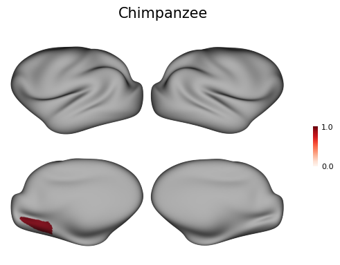
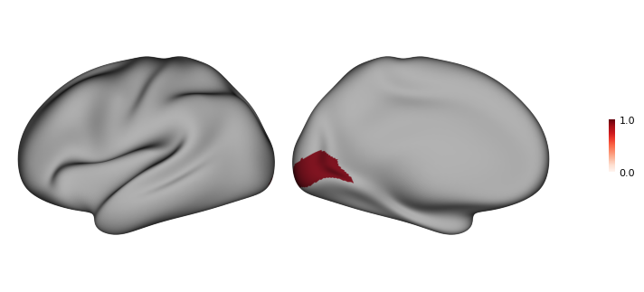

# 脑区图

🚧施工中🚧

## 全脑

### 快速出图

脑区图使用了`surfplot`的API，结合图集文件，成对对某块脑区值的绘制。

目前支持图集包括：

1. 人 Glasser图集[^1]
1. 人 BNA图集[^2]
1. 猕猴 CHARM 5-level图集[^3]
1. 猕猴 CHARM 6-level图集[^3]
1. 猕猴 BNA图集[^4]
1. 猕猴 D99图集[^5]
1. 黑猩猩 BNA图集[^6]

例如绘制人类Glasser图集中左脑V1区域值为1，右脑MT区域值为1.5。

[^1]:
    Glasser, M. F., Coalson, T. S., Robinson, E. C., Hacker, C. D., Harwell, J., Yacoub, E., Ugurbil, K., Andersson, J., Beckmann, C. F., Jenkinson, M., Smith, S. M., & Van Essen, D. C. (2016). A multi-modal parcellation of human cerebral cortex. Nature, 536(7615), Article 7615. https://doi.org/10.1038/nature18933
[^2]:
    Fan, L., Li, H., Zhuo, J., Zhang, Y., Wang, J., Chen, L., Yang, Z., Chu, C., Xie, S., Laird, A. R., Fox, P. T., Eickhoff, S. B., Yu, C., & Jiang, T. (2016). The Human Brainnetome Atlas: A New Brain Atlas Based on Connectional Architecture. Cerebral Cortex (New York, N.Y.: 1991), 26(8), 3508–3526. https://doi.org/10.1093/cercor/bhw157
[^3]:
    Jung, B., Taylor, P. A., Seidlitz, J., Sponheim, C., Perkins, P., Ungerleider, L. G., Glen, D., & Messinger, A. (2021). A comprehensive macaque fMRI pipeline and hierarchical atlas. NeuroImage, 235, 117997. https://doi.org/10.1016/j.neuroimage.2021.117997
[^4]:
    Lu, Y., Cui, Y., Cao, L., Dong, Z., Cheng, L., Wu, W., Wang, C., Liu, X., Liu, Y., Zhang, B., Li, D., Zhao, B., Wang, H., Li, K., Ma, L., Shi, W., Li, W., Ma, Y., Du, Z., … Jiang, T. (2024). Macaque Brainnetome Atlas: A multifaceted brain map with parcellation, connection, and histology. Science Bulletin, 69(14), 2241–2259. https://doi.org/10.1016/j.scib.2024.03.031
[^5]:
    Reveley, C., Gruslys, A., Ye, F. Q., Glen, D., Samaha, J., E. Russ, B., Saad, Z., K. Seth, A., Leopold, D. A., & Saleem, K. S. (2017). Three-Dimensional Digital Template Atlas of the Macaque Brain. Cerebral Cortex, 27(9), 4463–4477. https://doi.org/10.1093/cercor/bhw248
[^6]:
    Wang, Y., Cheng, L., Li, D., Lu, Y., Wang, C., Wang, Y., Gao, C., Wang, H., Erichsen, C. T., Vanduffel, W., Hopkins, W. D., Sherwood, C. C., Jiang, T., Chu, C., & Fan, L. (2025). The Chimpanzee Brainnetome Atlas reveals distinct connectivity and gene expression profiles relative to humans. The Innovation, 0(0). https://doi.org/10.1016/j.xinn.2024.100755


```python
from plotfig import *

data = {"lh_V1": 1, "rh_MT": 1.5}

fig = plot_human_brain_figure(data)
```


    

    


同样还可以绘制猕猴和黑猩猩的图像


```python
from plotfig import *

macaque_data = {"lh_V1": 1}
chimpanzee_data = {"lh_MVOcC.rv": 1}

fig = plot_macaque_brain_figure(macaque_data, title_name="Macaque")
fig = plot_chimpanzee_brain_figure(chimpanzee_data, title_name="Chimpanzee")
```


    

    


    

    


## 半脑


```python
from plotfig import *

data = {"lh_V1": 1}

fig = plot_human_hemi_brain_figure(data)
```


    

    

