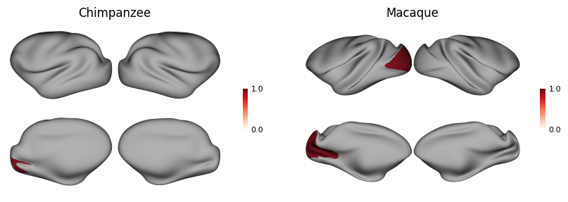
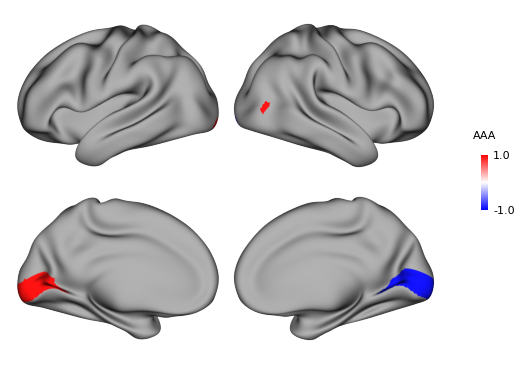

# 脑区图

脑区图是一种用于在大脑皮层表面可视化数值数据的图表。
它能够将不同脑区的数值映射到大脑皮层的相应区域，并以颜色编码的方式展示这些数值的分布情况。
这种图表常用于展示神经科学研究中的各种脑区指标，如BOLD信号强度、髓鞘化程度、体积或厚度或其他数值化的大脑特征。

`plot_brain_surface_figure` 函数基于 `surfplot` 库开发，提供了一个统一且简化的接口来绘制人脑、猕猴脑和黑猩猩脑的脑区图。
目前支持多种脑图谱包括：

1. 人 Glasser (HCP-MMP) 图集[^1]。[图集 CSV 文件](../../assets/atlas_csv/human_glasser.csv)。
1. 人 BNA 图集[^2]。[图集 CSV 文件](../../assets/atlas_csv/human_bna.csv)。
1. 黑猩猩 BNA 图集[^3]。[图集 CSV 文件](../../assets/atlas_csv/chimpanzee_bna.csv)。
1. 猕猴 CHARM 5-level [^4]。[图集 CSV 文件](../../assets/atlas_csv/macaque_charm5.csv)。
1. 猕猴 CHARM 6-level [^4]。[图集 CSV 文件](../../assets/atlas_csv/macaque_charm6.csv)。
1. 猕猴 BNA 图集[^5]。[图集 CSV 文件](../../assets/atlas_csv/macaque_bna.csv)。
1. 猕猴 D99 图集[^6]。[图集 CSV 文件](../../assets/atlas_csv/macaque_d99.csv)。

[^1]:
    Glasser, M. F., Coalson, T. S., Robinson, E. C., Hacker, C. D., Harwell, J., Yacoub, E., Ugurbil, K., Andersson, J., Beckmann, C. F., Jenkinson, M., Smith, S. M., & Van Essen, D. C. (2016). A multi-modal parcellation of human cerebral cortex. Nature, 536(7615), Article 7615. https://doi.org/10.1038/nature18933
[^2]:
    Fan, L., Li, H., Zhuo, J., Zhang, Y., Wang, J., Chen, L., Yang, Z., Chu, C., Xie, S., Laird, A. R., Fox, P. T., Eickhoff, S. B., Yu, C., & Jiang, T. (2016). The Human Brainnetome Atlas: A New Brain Atlas Based on Connectional Architecture. Cerebral Cortex (New York, N.Y.: 1991), 26(8), 3508–3526. https://doi.org/10.1093/cercor/bhw157
[^3]:
    Wang, Y., Cheng, L., Li, D., Lu, Y., Wang, C., Wang, Y., Gao, C., Wang, H., Erichsen, C. T., Vanduffel, W., Hopkins, W. D., Sherwood, C. C., Jiang, T., Chu, C., & Fan, L. (2025). The Chimpanzee Brainnetome Atlas reveals distinct connectivity and gene expression profiles relative to humans. The Innovation, 0(0). https://doi.org/10.1016/j.xinn.2024.100755
[^4]:
    Jung, B., Taylor, P. A., Seidlitz, J., Sponheim, C., Perkins, P., Ungerleider, L. G., Glen, D., & Messinger, A. (2021). A comprehensive macaque fMRI pipeline and hierarchical atlas. NeuroImage, 235, 117997. https://doi.org/10.1016/j.neuroimage.2021.117997
[^5]:
    Lu, Y., Cui, Y., Cao, L., Dong, Z., Cheng, L., Wu, W., Wang, C., Liu, X., Liu, Y., Zhang, B., Li, D., Zhao, B., Wang, H., Li, K., Ma, L., Shi, W., Li, W., Ma, Y., Du, Z., … Jiang, T. (2024). Macaque Brainnetome Atlas: A multifaceted brain map with parcellation, connection, and histology. Science Bulletin, 69(14), 2241–2259. https://doi.org/10.1016/j.scib.2024.03.031
[^6]:
    Reveley, C., Gruslys, A., Ye, F. Q., Glen, D., Samaha, J., E. Russ, B., Saad, Z., K. Seth, A., Leopold, D. A., & Saleem, K. S. (2017). Three-Dimensional Digital Template Atlas of the Macaque Brain. Cerebral Cortex, 27(9), 4463–4477. https://doi.org/10.1093/cercor/bhw248

## 全脑

### 快速出图

!!! warning
    画图前请确保脑区名字正确。


```python
from plotfig import *

data = {"lh_V1": 1, "rh_MT": 1.5}

ax = plot_brain_surface_figure(data, species="human", atlas="glasser")
```


    

    


```python
import matplotlib.pyplot as plt
from plotfig import *

macaque_data = {"lh_V1": 1}
chimpanzee_data = {"lh_MVOcC.rv": 1}

fig, (ax1, ax2) = plt.subplots(1, 2, figsize=(10, 5))

ax1 = plot_brain_surface_figure(
    chimpanzee_data, species="chimpanzee", atlas="bna", ax=ax1, title_name="Chimpanzee"
)
ax2 = plot_brain_surface_figure(
    macaque_data, species="macaque", atlas="charm5", ax=ax2, title_name="Macaque"
)
```


    

    


### 参数设置

全部参数见 [`plot_brain_surface_figure`](../api/index.md/#plotfig.brain_surface.plot_brain_surface_figure) 的 API 文档。


```python
from plotfig import *

data = {"lh_V1": 1, "rh_MT": 1.5, "rh_V1": -1}

ax = plot_brain_surface_figure(
    data,
    species="human",
    atlas="glasser",
    surf="inflated",
    cmap="bwr",
    vmin=-1,
    vmax=1,
    colorbar=True,
    colorbar_label_name="AAA"
)
```


    

    

