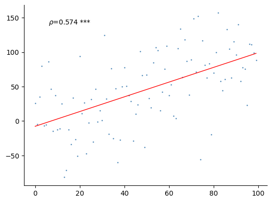

# 相关图

## 快速出图

假如我们有2组样本数量一致的数据（都有100个样本）。我们希望画图显示它们是否具有相关性。


```python
import numpy as np
import matplotlib.pyplot as plt
from plotfig import *

np.random.seed(42)
data1 = np.arange(100)
data2 = data1 + np.random.normal(1,50, 100)
# data2是在data1的基础上加上了噪声。
# 正经人都知道data1和data2相关，那么plotfig知不知道呢？

plot_correlation_figure(data1,data2)
```


    

    


## 参数设置

全部参数见[`plotfig.correlation`](../api/#plotfig.correlation)的API 文档。


```python
import numpy as np
import matplotlib.pyplot as plt
from plotfig import *

np.random.seed(42)
data1 = np.arange(100)
data2 = data1 + np.random.normal(1,50, 100)
# data2是在data1的基础上加上了噪声。
# 正经人都知道data1和data2相关，那么plotfig知不知道呢？

fig, ax = plt.subplots(figsize=(3, 3))
plot_correlation_figure(
    data1,
    data2,
    stats_method="spearman",  # 仅有“spearman, pearson”，默认是spearman
    ci=True,  # 显示95%置信区间
    dots_color="green",
    line_color="pink",
    title_name="Correlation between data1 and data2",
    title_fontsize=10,
    title_pad=20,  # 控制释标题和图的距离，默认是10
    x_label_name="Data1",
    y_label_name="Data2",
)
```


    

    

