# 单组柱状图

## 快速出图

柱状图（bar图）是一种常见的数据可视化工具，适用于比较不同类别的数据。`plotfig` 基于强大的 `matplotlib` 开发，简化了画图流程，使得多组数据的对比更加直观。

例如，我们有3组数据 （分别有9个样本、10个样本、11个样本）通过柱状图展示它们之间的差异。


```python
import numpy as np
from plotfig import *

data1 = np.random.normal(1, 1, 9)
data2 = np.random.normal(2, 1, 10)
data3 = np.random.normal(3, 1, 11)

plot_one_group_bar_figure([data1, data2, data3])
```


    
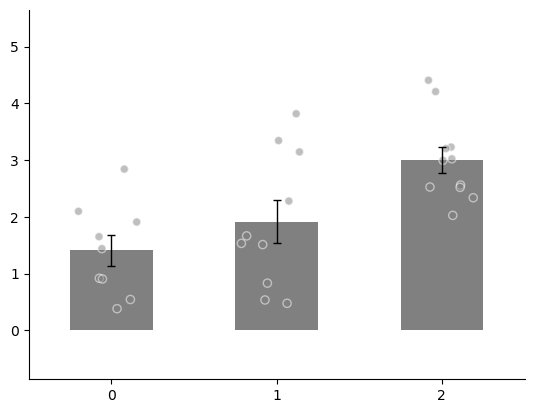
    


## 多子图

利用 `matplotlib` 我们可以在外部创建 `figure` 和 `axes`，完成多子图的绘制。


```python
import numpy as np
import matplotlib.pyplot as plt
from plotfig import *

ax1_bar1 = np.random.normal(0, 1, 7)
ax1_bar2 = np.random.normal(0, 1, 8)
ax2_bar1 = np.random.normal(0, 1, 9)
ax2_bar2 = np.random.normal(0, 1, 10)

fig, axes = plt.subplots(1, 2, figsize=(6, 3))
fig.subplots_adjust(wspace=0.5)
plot_one_group_bar_figure([ax1_bar1, ax1_bar2], ax=axes.flatten()[0])
plot_one_group_bar_figure([ax2_bar1, ax2_bar2], ax=axes.flatten()[1])
```


    
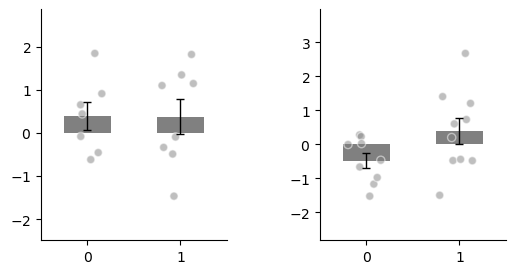
    


更多子图。


```python
import numpy as np
import matplotlib.pyplot as plt
from plotfig import *

ax1_bar1 = np.random.normal(3, 1, 7)
ax1_bar2 = np.random.normal(3, 1, 8)
ax2_bar1 = np.random.normal(3, 1, 9)
ax2_bar2 = np.random.normal(3, 1, 10)
ax3_bar1 = np.random.normal(3, 1, 9)
ax3_bar2 = np.random.normal(3, 1, 10)
ax4_bar1 = np.random.normal(3, 1, 9)
ax4_bar2 = np.random.normal(3, 1, 10)


fig, axes = plt.subplots(2, 2, figsize=(6, 6))
fig.subplots_adjust(wspace=0.5, hspace=0.5)
plot_one_group_bar_figure([ax1_bar1, ax1_bar2], ax=axes[0,0], labels_name=["A", "B"])
plot_one_group_bar_figure([ax2_bar1, ax2_bar2], ax=axes[0,1], labels_name=["C", "D"])
plot_one_group_bar_figure([ax3_bar1, ax3_bar2], ax=axes[1,0], labels_name=["E", "F"])
plot_one_group_bar_figure([ax4_bar1, ax4_bar2], ax=axes[1,1], labels_name=["G", "H"])
```


    
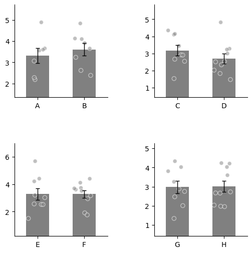
    


## 图的美化

### 参数设置

我们可以通过外面创建`fig`来控制图片的大小。
`plotfig`提供了大量的选项来自定义图。
全部参数见[`plotfig.bar.plot_one_group_bar_figure`](../api/index.md/#plotfig.bar.plot_one_group_bar_figure)的API 文档。


```python
import numpy as np
import matplotlib.pyplot as plt
from plotfig import *

data1 = np.random.normal(7, 1, 10)
data2 = np.random.normal(8, 1, 9)

fig, ax = plt.subplots(figsize=(3, 3))
plot_one_group_bar_figure(
    [data1, data2],
    ax=ax,
    labels_name=["A", "B"],
    x_label_name="x",
    y_label_name="y",
    title_name="Title name",
    title_fontsize=15,
    width=0.5,
    dots_size=15,
    colors=["#4573a5", "orange"],
    errorbar_type="sd",
    edgecolor="r",
)
```


    
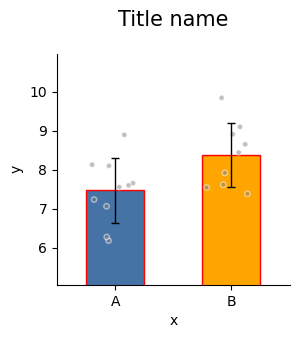
    


`plot_one_group_bar_figure` 允许将bar作为渐变色， 适合用来展示不同对象之间的关系结果。

假设我们计算了“人-黑猩猩，人-猕猴，黑猩猩-猕猴”同源的20个脑区之间的结构连接 Spearman 相关性。可以考虑使用这种展示方法。


```python
import numpy as np
import matplotlib.pyplot as plt
from plotfig import *


human_color = "#e38a48"
chimp_color = "#919191"
macaque_color = "#4573a5"

np.random.seed(42)
human_chimp = np.random.normal(7, 1, 20)
human_macaque = np.random.normal(7, 1, 20)
chimp_macaque = np.random.normal(7, 1, 20)

fig, ax = plt.subplots(figsize=(5,5))
plot_one_group_bar_figure(
    [human_chimp, human_macaque, chimp_macaque],
    ax=ax,
    labels_name=["Human-Chimp", "Human-Macaque", "Chimp-Macaque"],
    y_label_name="Spearman correlation",
    width=0.7,
    errorbar_type="sd",
    use_gradient_color=True,
    colors_start= [human_color, human_color, chimp_color],
    colors_end= [chimp_color, macaque_color, macaque_color]
)
```


    
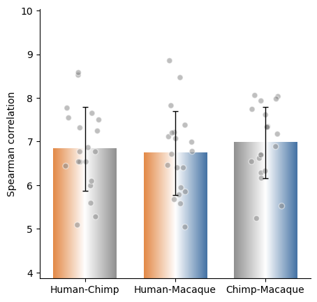
    


### 关于x轴

当x轴上的名字过长时，可以使用旋转。


```python
import numpy as np
import matplotlib.pyplot as plt
from plotfig import *

# 设置中文字体
plt.rcParams['font.family'] = "Microsoft YaHei"  # 微软雅黑
plt.rcParams['axes.unicode_minus'] = False  # 正确显示负号

data1 = np.random.normal(3, 1, 10)
data2 = np.random.normal(4, 1, 9)

fig, axes = plt.subplots(1, 4, figsize=(12, 3))
fig.subplots_adjust(wspace=0.5)
plot_one_group_bar_figure(
    [data1, data2],
    ax=axes[0],
    labels_name=["AAAAAAAAAAAAAA", "BBBBBBBBBBBBBB"],
    y_label_name="y",
    title_name="名字过长",
    title_fontsize=15,
)
plot_one_group_bar_figure(
    [data1, data2],
    ax=axes[1],
    labels_name=["AAAAAAAAAAAAAA", "BBBBBBBBBBBBBB"],
    y_label_name="y",
    title_name="锚定中间旋转",
    title_fontsize=15,
    x_tick_rotation=45,
    x_label_ha="center",  # 锚定中间旋转（默认）
)
plot_one_group_bar_figure(
    [data1, data2],
    ax=axes[2],
    labels_name=["AAAAAAAAAAAAAA", "BBBBBBBBBBBBBB"],
    y_label_name="y",
    title_name="锚定左边旋转",
    title_fontsize=15,
    x_tick_rotation=45,
    x_label_ha="left",  # 锚定左边旋转
)
plot_one_group_bar_figure(
    [data1, data2],
    ax=axes[3],
    labels_name=["AAAAAAAAAAAAAA", "BBBBBBBBBBBBBB"],
    y_label_name="y",
    title_name="锚定右边旋转",
    title_fontsize=15,
    x_tick_rotation=45,
    x_label_ha="right",  # 锚定右边旋转
)
```


    
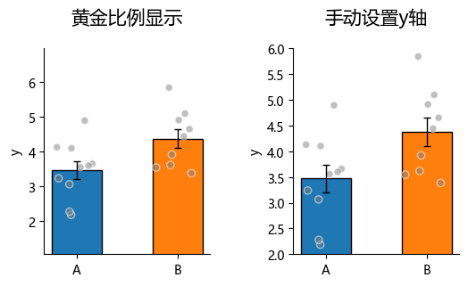
    


### 关于y轴

`plotfig`默认会自动计算最高点与最低点的位置，使最高点到最低点的距离占整个y轴的0.618（即黄金比例）。
有时，我们希望手动设置y轴的区间，可以使用`y_lim_range`选项。


```python
import numpy as np
import matplotlib.pyplot as plt
from plotfig import *

# 设置中文字体
plt.rcParams['font.family'] = "Microsoft YaHei"  # 微软雅黑
plt.rcParams['axes.unicode_minus'] = False  # 正确显示负号

data1 = np.random.normal(3, 1, 10)
data2 = np.random.normal(4, 1, 9)

fig, axes = plt.subplots(1, 2, figsize=(6, 3))
fig.subplots_adjust(wspace=0.5)
plot_one_group_bar_figure(
    [data1, data2],
    ax=axes[0],
    labels_name=["A", "B"],
    y_label_name="y",
    title_name="黄金比例显示",
    title_fontsize=15,
)
plot_one_group_bar_figure(
    [data1, data2],
    ax=axes[1],
    labels_name=["A", "B"],
    y_label_name="y",
    title_name="手动设置y轴",
    title_fontsize=15,
    y_lim_range=(2, 6)  # 设置y轴范围
)
```


    
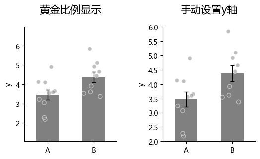
    


有时，我们希望y轴最下方为0，但是不确定最大值的高度。


```python
import numpy as np
import matplotlib.pyplot as plt
from plotfig import *

# 设置中文字体
plt.rcParams['font.family'] = "Microsoft YaHei"  # 微软雅黑
plt.rcParams['axes.unicode_minus'] = False  # 正确显示负号

data1 = np.random.normal(1,  1, 10)
data2 = np.random.normal(2, 1, 9)

fig, axes = plt.subplots(1, 2, figsize=(6, 3))
fig.subplots_adjust(wspace=0.5)
plot_one_group_bar_figure(
    [data1, data2],
    ax=axes[0],
    labels_name=["A", "B"],
    y_label_name="y",
    title_name="黄金比例显示",
    title_fontsize=15,
)
plot_one_group_bar_figure(
    [data1, data2],
    ax=axes[1],
    labels_name=["A", "B"],
    y_label_name="y",
    title_name="不显示负值",
    title_fontsize=15,
    ax_min_is_0=True,  # 不显示负值
)
```


    
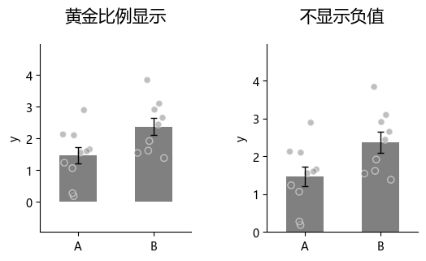
    


有时，我们希望y轴刻度最大只显示到1（例如y轴表示经过Fisher z转换的相关系数）。


```python
import numpy as np
import matplotlib.pyplot as plt
from plotfig import *

# 设置中文字体
plt.rcParams['font.family'] = "Microsoft YaHei"  # 微软雅黑
plt.rcParams['axes.unicode_minus'] = False  # 正确显示负号

data1 = np.random.normal(0.9,  0.1, 10)
data2 = np.random.normal(0.9, 0.1, 9)

fig, axes = plt.subplots(1, 2, figsize=(6, 3))
fig.subplots_adjust(wspace=0.5)
plot_one_group_bar_figure(
    [data1, data2],
    ax=axes[0],
    labels_name=["A", "B"],
    y_label_name="y",
    title_name="黄金比例显示",
    title_fontsize=15,
)
plot_one_group_bar_figure(
    [data1, data2],
    ax=axes[1],
    labels_name=["A", "B"],
    y_label_name="y",
    title_name="y轴最大刻度取1",
    title_fontsize=15,
    y_max_tick_to_one=True,  # y轴最大刻度取1
)
```


    
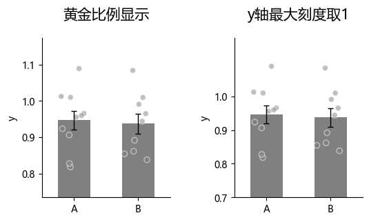
    


有时，我们希望修改Y轴的表达方式，例如Y轴用科学计数法表示。


```python
import numpy as np
import matplotlib.pyplot as plt
from plotfig import *

# 设置中文字体
plt.rcParams['font.family'] = "Microsoft YaHei"  # 微软雅黑
plt.rcParams['axes.unicode_minus'] = False  # 正确显示负号

data1 = np.random.normal(10000, 1000, 10)
data2 = np.random.normal(11000, 1000, 9)
data3 = np.random.normal(0.0001, 0.0001, 11)
data4 = np.random.normal(0.0001, 0.0001, 12)

fig, axes = plt.subplots(2, 2, figsize=(6, 6))
fig.subplots_adjust(wspace=0.5, hspace=0.5)
plot_one_group_bar_figure(
    [data1, data2],
    ax=axes[0,0],
    labels_name=["A", "B"],
    y_label_name="y",
    title_name="科学计数法",
    title_fontsize=15,
)  # 默认y轴使用科学计数法
plot_one_group_bar_figure(
    [data1, data2],
    ax=axes[0,1],
    labels_name=["A", "B"],
    y_label_name="y",
    title_name="无科学计数法",
    title_fontsize=15,
    math_text=False,  # 手动关闭科学计数法
)
plot_one_group_bar_figure(
    [data3, data4],
    ax=axes[1,0],
    labels_name=["A", "B"],
    y_label_name="y",
    title_name="科学计数法",
    title_fontsize=15,
)  # 默认y轴使用科学计数法
plot_one_group_bar_figure(
    [data3, data4],
    ax=axes[1,1],
    labels_name=["A", "B"],
    y_label_name="y",
    title_name="无科学计数法",
    title_fontsize=15,
    math_text=False,  # 手动关闭科学计数法
)
```


    
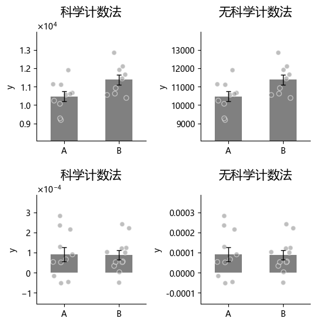
    


有时，我们希望y轴显示百分比（“percentage”会与“math_text”冲突，需要手动关闭“math_text”）


```python
import numpy as np
import matplotlib.pyplot as plt
from plotfig import *

# 设置中文字体
plt.rcParams['font.family'] = "Microsoft YaHei"  # 微软雅黑
plt.rcParams['axes.unicode_minus'] = False  # 正确显示负号

data1 = np.random.normal(0.5,  0.1, 10)
data2 = np.random.normal(0.5, 0.1, 9)

fig, axes = plt.subplots(1, 2, figsize=(6, 3))
fig.subplots_adjust(wspace=0.5)
plot_one_group_bar_figure(
    [data1, data2],
    ax=axes[0],
    labels_name=["A", "B"],
    y_label_name="y",
    title_name="常规显示",
    title_fontsize=15,
)
plot_one_group_bar_figure(
    [data1, data2],
    ax=axes[1],
    labels_name=["A", "B"],
    y_label_name="y",
    title_name="显示百分比",
    title_fontsize=15,
    math_text=False,
    percentage=True,
)
```


    
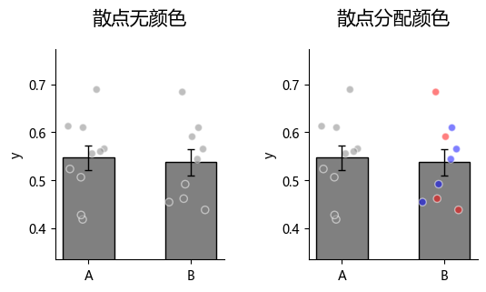
    


### 关于散点

我们可以为每个散点分配颜色（可用于区分不同来源的数据）。


```python
import numpy as np
import matplotlib.pyplot as plt
from plotfig import *

# 设置中文字体
plt.rcParams['font.family'] = "Microsoft YaHei"  # 微软雅黑
plt.rcParams['axes.unicode_minus'] = False  # 正确显示负号

data1 = np.random.normal(0.5,  0.1, 10)
data2 = np.random.normal(0.5, 0.1, 9)
dots_color1 = [["blue"]*10, ["red"]*9]
dots_color2 = [["green"]*5+["pink"]*5, ["orange"]*4+["purple"]*5]

fig, axes = plt.subplots(1, 2, figsize=(6, 3))
fig.subplots_adjust(wspace=0.5)
plot_one_group_bar_figure(
    [data1, data2],
    ax=axes[0],
    labels_name=["A", "B"],
    y_label_name="y",
    title_name="散点统一颜色",
    title_fontsize=15,
    dots_color=dots_color1,  # 散点颜色
)
plot_one_group_bar_figure(
    [data1, data2],
    ax=axes[1],
    labels_name=["A", "B"],
    y_label_name="y",
    title_name="散点各自分配颜色",
    title_fontsize=15,
    dots_color=dots_color2,  # 散点颜色
)
```


    
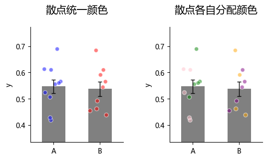
    


## 统计

`plotfig`可以快速为bar间比较进行统计。
目前支持的统计方法有：

1. 独立样本t检验：`ttest_ind`
2. 配对样本t检验：`ttest_rel`
3. Mann-Whitney U检验：`mannwhitneyu`
4. 外部检验：`external`

> 外部检验`external`指用户可在外部利用其他统计软件自行进行检验，只需传入检验p值即可。

所有统计方法需要先通过`statistic`选项启用，然后将方法名传入`test_method`选项即可。
外部检验需额外传入p值列表。


```python
import numpy as np
import matplotlib.pyplot as plt
from plotfig import *

# 设置中文字体
plt.rcParams['font.family'] = "Microsoft YaHei"  # 微软雅黑
plt.rcParams['axes.unicode_minus'] = False  # 正确显示负号

np.random.seed(42)
data1 = np.random.normal(3, 1, 30)
data2 = np.random.normal(4, 1, 31)
data3 = np.random.normal(5, 1, 31)
data4 = np.random.normal(2, 1, 9)
data5 = np.random.normal(4, 1, 10)

fig, axes = plt.subplots(2, 2, figsize=(6, 6))
fig.subplots_adjust(wspace=0.5, hspace=0.5)
plot_one_group_bar_figure(
    [data1, data2],
    ax=axes[0,0],
    labels_name=["A", "B"],
    y_label_name="y",
    title_name="独立样本t检验",
    title_fontsize=15,
    statistic=True, 
    test_method="ttest_ind"
)
plot_one_group_bar_figure(
    [data2, data3],
    ax=axes[0,1],
    labels_name=["A", "B"],
    y_label_name="y",
    title_name="配对样本t检验",
    title_fontsize=15,
    statistic=True, 
    test_method="ttest_rel"
)
plot_one_group_bar_figure(
    [data4, data5],
    ax=axes[1,0],
    labels_name=["A", "B"],
    y_label_name="y",
    title_name="Mann-Whitney U检验",
    title_fontsize=15,
    statistic=True, 
    test_method="mannwhitneyu"
)
plot_one_group_bar_figure(
    [data1, data2],
    ax=axes[1,1],
    labels_name=["A", "B"],
    y_label_name="y",
    title_name="外部检验",
    title_fontsize=15,
    statistic=True, 
    test_method="external",
    p_list=[0.01],
)
```


    
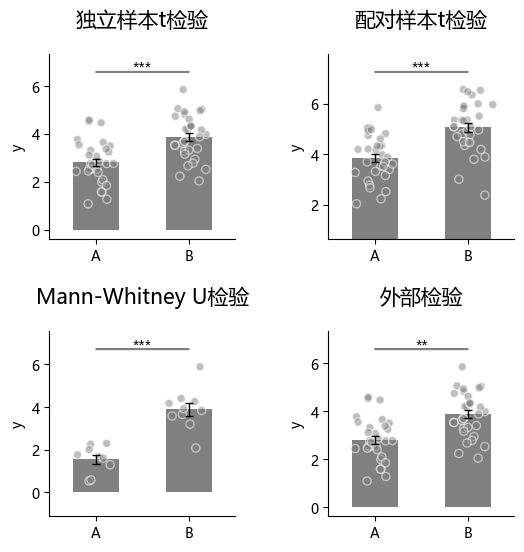
    


当使用外部统计，且有多个bar之间需要比较。时遵循：1->2, 1->3, 1->n，2->3, 2->n，3->n的顺序传入p值，依次类推。


```python
import numpy as np
import matplotlib.pyplot as plt
from plotfig import *

# 设置中文字体
plt.rcParams['font.family'] = "Microsoft YaHei"  # 微软雅黑
plt.rcParams['axes.unicode_minus'] = False  # 正确显示负号

np.random.seed(42)
data1 = np.random.normal(5,  1, 20)
data2 = np.random.normal(7, 1, 20)
data3 = np.random.normal(7, 1, 20)
data4 = np.random.normal(9, 1, 20)

p_list = [0.05, 0.01, 0.001, 1, 0.05, 0.01]

fig, ax = plt.subplots(figsize=(6, 6))
plot_one_group_bar_figure(
    [data1, data2, data3, data4],
    ax=ax,
    y_label_name="y",
    title_name="外部检验",
    title_fontsize=15,
    statistic=True,
    test_method="external",
    p_list=p_list,
)
```


    
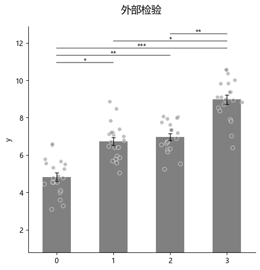
    

